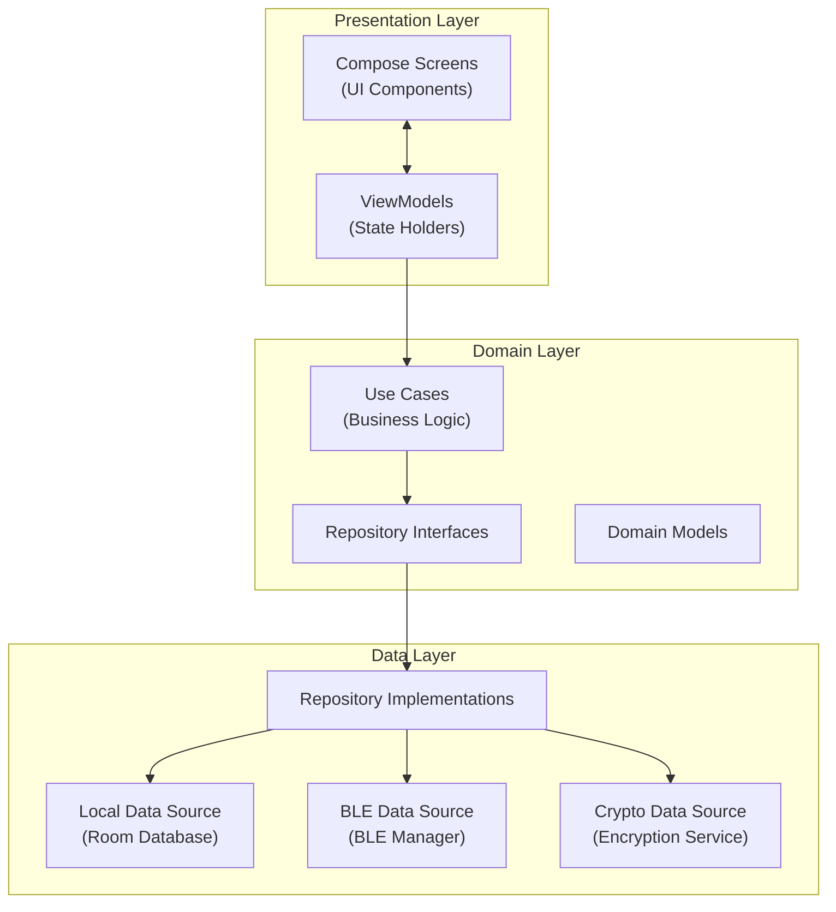
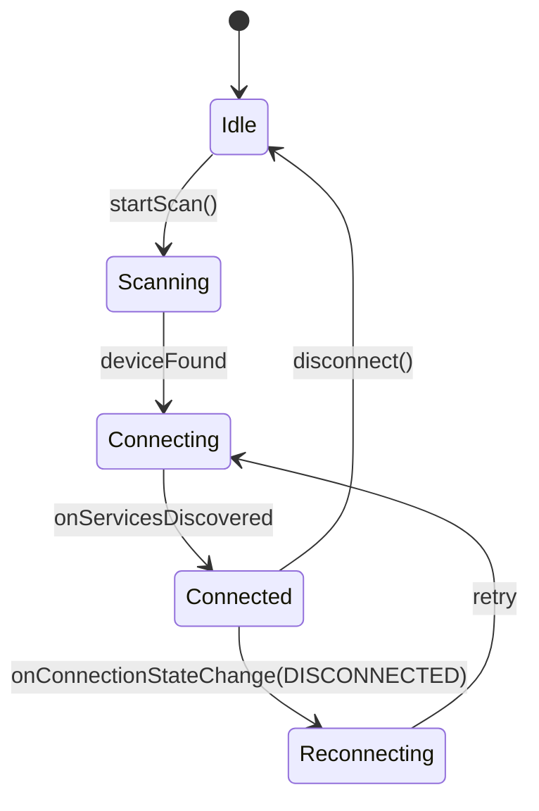
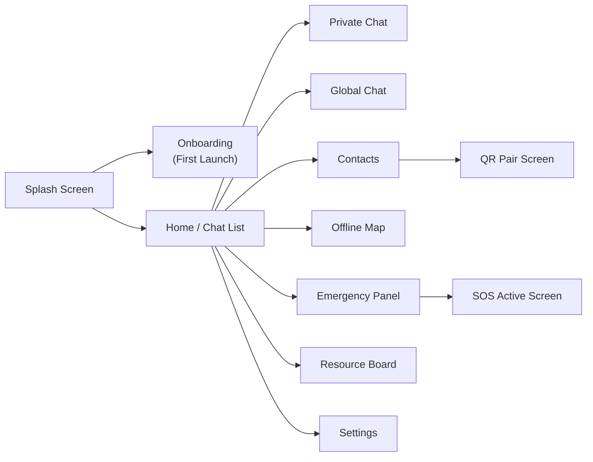

# App Architecture

**Platform:** Android  
**Language:** Kotlin  
**UI Framework:** Jetpack Compose  
**Architecture Pattern:** MVVM + Clean Architecture  
**Database:** Room (SQLite)  
**Concurrency:** Kotlin Coroutines + Flow  

---

## Architecture Layers



---

## Package Structure

```
com.mesh.emergency/
├── di/                        # Dependency injection modules (Hilt)
├── presentation/
│   ├── screens/
│   │   ├── chat/              # Private and global chat screens
│   │   ├── contacts/          # Contact list and discovery
│   │   ├── emergency/         # SOS, emergency status
│   │   ├── map/               # Offline map screen
│   │   ├── profile/           # User profile and QR code
│   │   ├── resources/         # Resource board
│   │   └── settings/          # App settings
│   ├── viewmodels/            # ViewModels per screen
│   ├── components/            # Shared Compose components
│   └── navigation/            # NavHost, routes, deep links
├── domain/
│   ├── model/                 # Domain data classes
│   ├── usecase/               # One use case per business operation
│   └── repository/            # Repository interfaces
├── data/
│   ├── local/
│   │   ├── dao/               # Room DAOs
│   │   ├── entity/            # Room entity classes
│   │   └── database/          # AppDatabase, migrations
│   ├── ble/
│   │   ├── BleManager.kt      # BLE Central connection manager
│   │   ├── BleScanner.kt      # Device discovery
│   │   ├── GattCallback.kt    # GATT event handling
│   │   └── PacketSerializer.kt
│   ├── crypto/
│   │   ├── CryptoEngine.kt    # AES-256 + ECDH
│   │   ├── KeyStore.kt        # Android Keystore integration
│   │   └── SignatureVerifier.kt
│   └── repository/            # Repository implementations
└── util/
    ├── QrCodeGenerator.kt
    ├── GpsHelper.kt
    └── AudioEncoder.kt
```

---

## Presentation Layer

### Compose Screens

Each screen is a stateless `@Composable` function that observes a `StateFlow` from its ViewModel.

```kotlin
@Composable
fun ChatScreen(
    viewModel: ChatViewModel = hiltViewModel()
) {
    val uiState by viewModel.uiState.collectAsStateWithLifecycle()
    ChatContent(
        messages = uiState.messages,
        onSendMessage = viewModel::sendMessage,
        onSosPress = viewModel::triggerSos
    )
}
```

### ViewModels

ViewModels hold UI state, invoke Use Cases, and expose `StateFlow` to Compose screens. They do not contain business logic or data access logic.

```kotlin
@HiltViewModel
class ChatViewModel @Inject constructor(
    private val sendMessageUseCase: SendMessageUseCase,
    private val getMessagesUseCase: GetMessagesUseCase
) : ViewModel() {

    val uiState: StateFlow<ChatUiState> = ...

    fun sendMessage(content: String, recipientId: String) {
        viewModelScope.launch {
            sendMessageUseCase(content, recipientId)
        }
    }
}
```

---

## Domain Layer

### Use Cases

Each use case encapsulates exactly one business operation. Use cases are the only entry point from the presentation layer to the data layer.

| Use Case | Responsibility |
|---|---|
| `SendMessageUseCase` | Encrypt, serialize, and enqueue a message for BLE transmission |
| `GetMessagesUseCase` | Return a Flow of messages for a given conversation |
| `TriggerSosUseCase` | Set SOS flag, capture GPS, enqueue SOS packet |
| `DiscoverNodesUseCase` | Start BLE scan and emit discovered node events |
| `PairContactUseCase` | Parse QR code, store contact and public key |
| `ShareLocationUseCase` | Capture GPS coordinates and send LOCATION packet |
| `GetPowerStatusUseCase` | Return a Flow of power telemetry from BLE |

### Domain Models

Domain models are plain Kotlin data classes with no Android or Room dependencies.

```kotlin
data class Message(
    val id: String,
    val senderId: String,
    val receiverId: String,
    val content: String,
    val timestamp: Long,
    val type: MessageType,
    val priority: Priority,
    val deliveryStatus: DeliveryStatus
)

enum class MessageType { TEXT, VOICE, SOS, LOCATION, RESOURCE, GLOBAL }
enum class Priority { CRITICAL, HIGH, NORMAL, LOW }
enum class DeliveryStatus { QUEUED, SENT, DELIVERED, FAILED }
```

---

## Data Layer

### BLE Manager

`BleManager` is a singleton that manages the lifecycle of the BLE Central connection to the ESP32 GATT Server.



**Key Responsibilities:**
- Maintain a persistent BLE connection to the paired ESP32 node
- Write outbound packets to the TX characteristic
- Receive inbound packets via GATT notifications
- Expose connection state and incoming packets as `StateFlow`

### Repository Implementations

Each repository implementation aggregates data from one or more sources and maps between data layer entities and domain models.

```kotlin
class MessageRepositoryImpl @Inject constructor(
    private val messageDao: MessageDao,
    private val bleManager: BleManager,
    private val cryptoEngine: CryptoEngine
) : MessageRepository {

    override fun getMessages(contactId: String): Flow<List<Message>> =
        messageDao.getMessagesByContact(contactId)
            .map { entities -> entities.map { it.toDomain() } }

    override suspend fun sendMessage(message: Message) {
        val encrypted = cryptoEngine.encrypt(message.content, contactPublicKey)
        val packet = PacketSerializer.serialize(message.copy(content = encrypted))
        bleManager.transmit(packet)
        messageDao.insert(message.toEntity())
    }
}
```

---

## BLE Communication Layer

### GATT Service UUIDs

| Service / Characteristic | UUID | Properties |
|---|---|---|
| Mesh Service | `0x1820` (custom) | — |
| TX Characteristic (App → ESP32) | `0x2A6E` (custom) | Write |
| RX Characteristic (ESP32 → App) | `0x2A6F` (custom) | Notify |
| Status Characteristic | `0x2A70` (custom) | Read, Notify |

### Packet Serialization

Packets are serialized to JSON and encoded as UTF-8 bytes before being written to the BLE characteristic. Large payloads (e.g., VOICE) are fragmented into 512-byte chunks with sequence headers.

---

## Navigation



---

## Dependency Injection

Dependency injection is managed by **Hilt**. Modules are organized by layer:

| Module | Provides |
|---|---|
| `DatabaseModule` | `AppDatabase`, all DAOs |
| `BleModule` | `BleManager`, `BleScanner` |
| `CryptoModule` | `CryptoEngine`, `KeyStore` |
| `RepositoryModule` | All repository bindings |
