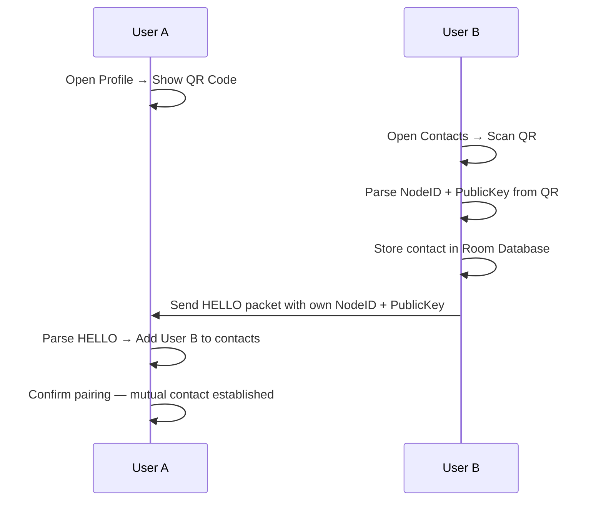

# App Features

---

## User Profile and Identity

### First Launch Setup
On first launch, the app generates a UUID as the user's permanent Node ID and creates an ECDH key pair. The public key is stored in Room Database and associated with the Node ID. The private key is stored in the Android Keystore.

The user is prompted to set:
- Display name
- Optional avatar (emoji-based, no photo required)
- Language preference
- Visibility preference (public / private BLE advertisement)

### Profile Screen
The profile screen displays:
- Display name and avatar
- Node ID (truncated for readability)
- QR code encoding `NodeID:PublicKey`
- Current status (Normal / Emergency / Rescue)
- BLE visibility toggle

### QR Code Pairing Flow

---

## Chat Screens

### Private Chat
- Message list displayed as a conversation thread (sender bubbles on right, receiver on left)
- Input field with send button, voice record button, and attachment (location, resource)
- Message status indicators: Queued → Sent → Delivered (ACK received)
- Long-press on message: copy, delete, resend options

### Global Chat
- All mesh-visible messages displayed in chronological order
- Sender display name shown above each message
- No encryption — all mesh participants can read
- Filter: show only messages from contacts

### Emergency Broadcast Panel
- Large, high-contrast "EMERGENCY BROADCAST" button
- Broadcasts a message to all nodes in the mesh with critical priority
- Confirm dialog before sending to prevent accidental activation

---

## Emergency Panel

### SOS Screen
Activated by a large physical-style SOS button, requiring a two-step confirmation.

On activation:
1. App captures current GPS coordinates
2. Sends SOS packet with coordinates to mesh
3. Repeats every 60 seconds (configurable: 30 / 60 / 120 s)
4. Sets user status to EMERGENCY
5. Displays active SOS timer and repeat countdown

Cancellation clears emergency status and stops repeat broadcasts.

### Emergency Status
Users can manually set status to:

| Status | Description | Packet Effect |
|---|---|---|
| Normal | Default state | Standard priority |
| Emergency | In distress, needs help | Elevated routing priority |
| Rescue | First responder / rescue team | Priority routing, trust badge |
| Coordinator | Group leader / command post | Priority routing |

Status is embedded in all HELLO packets and displayed as a badge on the contact list.

---

## Offline Map

### Map Engine
The app uses an embedded offline tile renderer (e.g., OsmDroid or MapLibre with bundled OpenStreetMap tiles). No internet connection is required to display or navigate the map.

### Map Features
- Display current device GPS position
- Show contacts with active location sharing as map markers
- Tap a marker to open quick chat or send resource offer
- SOS markers shown with distinct red icon and pulsing animation
- Map layers: standard, satellite (if tiles available), terrain

### Location Sharing Controls
- "Share My Location" button in map screen — initiates time-limited sharing
- Duration selector: 15 min / 1 hour / Until I stop
- Active sharing shown as a countdown badge in the status bar

---

## Resource Board

Resource sharing enables coordinated logistics during emergencies.

### Resource Entry Fields

| Field | Type | Example |
|---|---|---|
| Type | Enum | Water / Food / Medical / Shelter / Tools |
| Quantity | Text | "20 liters" / "10 portions" |
| Location | GPS or text | Coordinates or "North gate of school" |
| Contact | Node ID | Sender's Node ID for reply |
| Expiry | Timestamp | Auto-expires after 6 hours |

### Resource Board Screen
- Aggregated list of all received RESOURCE packets
- Sorted by distance (closest first, using GPS)
- Filter by resource type
- Tap to open private chat with resource owner

---

## Settings

| Setting | Description |
|---|---|
| Display Name | Edit user display name |
| Language | Select app language (multi-language support) |
| BLE Visibility | Toggle public / private BLE advertising |
| Location Permission | Manage location sharing permissions |
| SOS Repeat Interval | 30 / 60 / 120 seconds |
| Message TTL | Default hop limit for outbound messages |
| Store & Forward | Enable / disable local message caching for relay |
| Power Monitoring | Enable / disable INA219/226 polling |
| Node Pairing | Reset paired ESP32 node |
| Clear Data | Wipe all messages and contacts |

---

## Power Monitor Screen

Accessible from the status bar when connected to a node that includes an INA219/INA226 sensor.

| Displayed Value | Source | Refresh Rate |
|---|---|---|
| Bus Voltage | INA219/226 | 5 seconds |
| Current Draw | INA219/226 | 5 seconds |
| Power Consumption | Calculated (V × A) | 5 seconds |
| Estimated Remaining | Configured battery Ah | Derived |
| Node Temperature (if available) | ESP32 internal sensor | 30 seconds |

---

## Voice Messages

1. User holds the "Record" button in the chat input bar
2. Audio is recorded using Android `MediaRecorder` in AAC/M4A format at 8 kHz mono (low bitrate for minimal packet size)
3. The encoded audio blob is chunked into ≤ 240-byte segments
4. Each chunk is sent as a VOICE packet with fields: `sequenceNumber`, `totalChunks`, `conversationId`
5. The receiver buffers incoming VOICE chunks, reassembles them in order, and plays back automatically when all chunks arrive

---

## Multi-Language Support

The app uses Android's standard resource localization (`strings.xml` per locale). The following languages are planned:

| Language | Code |
|---|---|
| English | en |
| Arabic | ar |
| French | fr |
| Spanish | es |
| Urdu | ur |
| Bengali | bn |

RTL layout is supported for Arabic and Urdu via Android's automatic RTL mirroring in Jetpack Compose.

---

## Notifications

| Event | Notification Type |
|---|---|
| Incoming private message | Standard notification with sender name |
| Incoming SOS from contact | High-priority full-screen intent |
| Emergency broadcast received | High-priority heads-up notification |
| BLE connection lost | Persistent status bar notification |
| New contact discovered | Standard notification |
