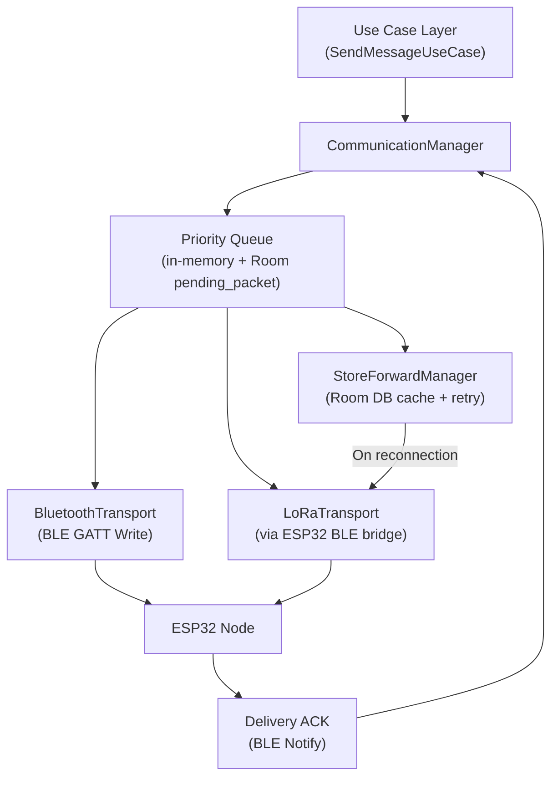
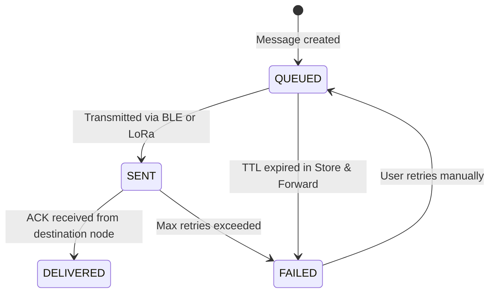

# Communication Manager

**Module:** `data/communication/CommunicationManager.kt`  
**Layer:** Data Layer (Android Application)  
**Pattern:** Singleton, injected via Hilt  

---

## Purpose

The Communication Manager is the single module responsible for deciding **how** every outbound message is delivered. It is transparent to the user — no manual transport selection is ever exposed in the UI.

---

## Transport Priority

The Communication Manager evaluates the following transports in order, using the first one that is available:

```
1. Bluetooth Transport    — receiver's ESP32 is within BLE range (nearby)
        ↓ (not available)
2. LoRa Transport         — receiver reachable over the LoRa mesh (long distance)
        ↓ (not available)
3. Store & Forward        — receiver is offline; message cached and retried later
```

---

## Responsibilities

| Responsibility | Description |
|---|---|
| **Transport selection** | Evaluates BLE proximity and last-known node reachability to select Bluetooth, LoRa, or Store & Forward |
| **Retry logic** | Automatically retries failed deliveries using exponential backoff |
| **Priority queue** | Outbound messages are queued by priority: Critical → High → Normal → Low |
| **Delivery status** | Tracks and exposes per-message status: `QUEUED` → `SENT` → `DELIVERED` / `FAILED` |
| **Message routing** | Passes packets to the correct transport class; never exposed to UI layer |

---

## Architecture Diagram



---

## Transport Selection Logic

```kotlin
suspend fun send(message: Message) {
    val encrypted = cryptoEngine.encrypt(message)
    val packet = PacketSerializer.serialize(encrypted)

    val deliveryStatus = when {
        bluetoothTransport.isReceiverReachable(message.receiverId) ->
            bluetoothTransport.send(packet)

        loRaTransport.isReceiverKnown(message.receiverId) ->
            loRaTransport.send(packet)

        else ->
            storeForwardManager.enqueue(packet)
    }

    messageDao.updateDeliveryStatus(message.id, deliveryStatus)
}
```

### Receiver Reachability Rules

| Transport | Condition |
|---|---|
| `BluetoothTransport` | Receiver's ESP32 Node ID is in current BLE scan results (active or cached within 30 s) |
| `LoRaTransport` | Receiver's Node ID appeared in a HELLO packet within the last 10 minutes |
| `StoreForwardManager` | Neither condition is met; receiver is considered offline |

---

## Priority Queue

All outbound messages are queued before transport selection. The queue is ordered by priority so that critical messages (SOS, Emergency Broadcast) are always sent first, regardless of when they were enqueued.

| Priority | Value | Packet Types |
|---|---|---|
| Critical | 0 | SOS, Emergency Broadcast |
| High | 1 | ACK, LOCATION (rescue contacts) |
| Normal | 2 | TEXT, VOICE, RESOURCE, GLOBAL_CHAT |
| Low | 3 | HELLO, power telemetry |

The queue is backed by both an in-memory priority queue (for active processing) and the Room `pending_packet` table (for persistence across app restarts).

---

## Delivery Status Lifecycle



| Status | Description |
|---|---|
| `QUEUED` | Message is in the outbound queue awaiting transmission |
| `SENT` | Packet has been written to the transport (BLE characteristic or LoRa TX queue) |
| `DELIVERED` | ACK packet received from the destination node |
| `FAILED` | All retry attempts exhausted or TTL expired |

---

## Retry Logic

| Scenario | Behavior |
|---|---|
| BLE write fails | Retry up to 3 times immediately; then fall back to LoRa |
| LoRa no ACK within 30 s | Re-enqueue with incremented retry count |
| Max retries (20) reached | Status set to FAILED; stored in Room for manual retry |
| Receiver comes online (HELLO received) | StoreForwardManager retransmits all cached packets for that Node ID |

---

## Dependency Injection

```kotlin
@Module
@InstallIn(SingletonComponent::class)
object CommunicationModule {

    @Provides
    @Singleton
    fun provideBluetoothTransport(scanner: BleScanner): BluetoothTransport =
        BluetoothTransport(scanner)

    @Provides
    @Singleton
    fun provideLoRaTransport(bleTransport: BluetoothTransport): LoRaTransport =
        LoRaTransport(bleTransport)

    @Provides
    @Singleton
    fun provideStoreForwardManager(
        pendingPacketDao: PendingPacketDao,
        loRaTransport: LoRaTransport
    ): StoreForwardManager = StoreForwardManager(pendingPacketDao, loRaTransport)

    @Provides
    @Singleton
    fun provideCommunicationManager(
        bluetoothTransport: BluetoothTransport,
        loRaTransport: LoRaTransport,
        storeForwardManager: StoreForwardManager,
        cryptoEngine: CryptoEngine,
        messageDao: MessageDao
    ): CommunicationManager =
        CommunicationManager(bluetoothTransport, loRaTransport, storeForwardManager, cryptoEngine, messageDao)
}
```

---

## Related Documents

- [Transport Layer](transport-layer.md) — Detailed documentation for each transport implementation
- [App Architecture](app-architecture.md) — Overall Clean Architecture structure
- [Packet Protocol](../firmware/packet-protocol.md) — Packet format and field reference
- [Database Design](database-design.md) — `pending_packet` table for Store & Forward persistence
