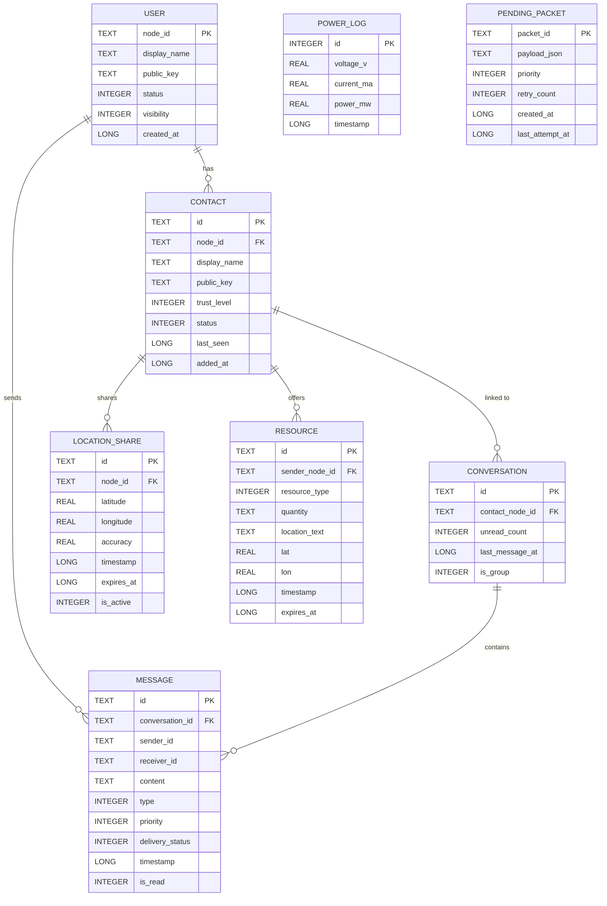

# Database Design

**Engine:** SQLite via Room  
**ORM:** Room Persistence Library  
**Query Interface:** DAOs with Kotlin Coroutines + Flow  

---

## Entity Relationship Diagram



---

## Table Definitions

### `user` Table

Stores the local user's identity. Only one row exists — the device owner's profile.

| Column | Type | Constraints | Description |
|---|---|---|---|
| `node_id` | TEXT | PRIMARY KEY | UUID — generated at first launch |
| `display_name` | TEXT | NOT NULL | User-chosen display name |
| `public_key` | TEXT | NOT NULL | Base64-encoded ECDH public key |
| `status` | INTEGER | DEFAULT 0 | 0=Normal, 1=Emergency, 2=Rescue, 3=Coordinator |
| `visibility` | INTEGER | DEFAULT 1 | 0=Private, 1=Public BLE advertisement |
| `created_at` | INTEGER | NOT NULL | Unix timestamp (ms) |

---

### `contact` Table

Stores discovered and paired remote users.

| Column | Type | Constraints | Description |
|---|---|---|---|
| `id` | TEXT | PRIMARY KEY | Auto-generated contact record UUID |
| `node_id` | TEXT | NOT NULL, UNIQUE | Remote user's Node UUID |
| `display_name` | TEXT | NOT NULL | User-assigned or received display name |
| `public_key` | TEXT | | Base64-encoded ECDH public key (null until paired) |
| `trust_level` | INTEGER | DEFAULT 0 | 0=Discovered, 1=Paired, 2=Trusted |
| `status` | INTEGER | DEFAULT 0 | Emergency status mirrored from HELLO packets |
| `last_seen` | INTEGER | | Unix timestamp (ms) of last received packet |
| `added_at` | INTEGER | NOT NULL | Unix timestamp (ms) |

**Indexes:** `node_id` (unique), `last_seen` (for sorting)

---

### `conversation` Table

One row per conversation thread (private or group).

| Column | Type | Constraints | Description |
|---|---|---|---|
| `id` | TEXT | PRIMARY KEY | UUID |
| `contact_node_id` | TEXT | FOREIGN KEY → contact | Null for group/global |
| `unread_count` | INTEGER | DEFAULT 0 | Count of unread messages |
| `last_message_at` | INTEGER | | Timestamp for sorting conversation list |
| `is_group` | INTEGER | DEFAULT 0 | 1 = Global / Group chat |

---

### `message` Table

Stores all sent and received messages.

| Column | Type | Constraints | Description |
|---|---|---|---|
| `id` | TEXT | PRIMARY KEY | Message UUID (matches packet `id` field) |
| `conversation_id` | TEXT | FOREIGN KEY → conversation | Parent conversation |
| `sender_id` | TEXT | NOT NULL | Sender's Node ID |
| `receiver_id` | TEXT | NOT NULL | Receiver's Node ID or "BROADCAST" |
| `content` | TEXT | NOT NULL | Decrypted message content (plaintext) |
| `type` | INTEGER | NOT NULL | Enum: TEXT=0, VOICE=1, SOS=2, LOCATION=3, RESOURCE=4 |
| `priority` | INTEGER | DEFAULT 2 | 0=Critical, 1=High, 2=Normal, 3=Low |
| `delivery_status` | INTEGER | DEFAULT 0 | 0=Queued, 1=Sent, 2=Delivered, 3=Failed |
| `timestamp` | INTEGER | NOT NULL | Unix timestamp (ms) from packet |
| `is_read` | INTEGER | DEFAULT 0 | 0=Unread, 1=Read |

**Indexes:** `conversation_id + timestamp` (composite, for efficient thread loading)

---

### `location_share` Table

Tracks active and historical location shares from contacts.

| Column | Type | Constraints | Description |
|---|---|---|---|
| `id` | TEXT | PRIMARY KEY | UUID |
| `node_id` | TEXT | NOT NULL | Node ID of the sharing user |
| `latitude` | REAL | NOT NULL | GPS latitude |
| `longitude` | REAL | NOT NULL | GPS longitude |
| `accuracy` | REAL | | Accuracy in meters |
| `timestamp` | INTEGER | NOT NULL | Time of the location fix |
| `expires_at` | INTEGER | | Expiry timestamp; null = no expiry |
| `is_active` | INTEGER | DEFAULT 1 | 1=Currently sharing |

---

### `resource` Table

Aggregated resource offers received from the mesh.

| Column | Type | Constraints | Description |
|---|---|---|---|
| `id` | TEXT | PRIMARY KEY | UUID from packet |
| `sender_node_id` | TEXT | NOT NULL | Sender's Node ID |
| `resource_type` | INTEGER | NOT NULL | 0=Water, 1=Food, 2=Medical, 3=Shelter, 4=Tools |
| `quantity` | TEXT | | Free-text quantity description |
| `location_text` | TEXT | | Free-text location |
| `lat` | REAL | | GPS latitude of resource |
| `lon` | REAL | | GPS longitude |
| `timestamp` | INTEGER | NOT NULL | Time of offer |
| `expires_at` | INTEGER | | Auto-expire timestamp |

---

### `power_log` Table

Historical power telemetry from the INA219/INA226 sensor.

| Column | Type | Constraints | Description |
|---|---|---|---|
| `id` | INTEGER | PRIMARY KEY, AUTOINCREMENT | Auto-incremented ID |
| `voltage_v` | REAL | NOT NULL | Bus voltage in volts |
| `current_ma` | REAL | NOT NULL | Current in milliamps |
| `power_mw` | REAL | NOT NULL | Power in milliwatts |
| `timestamp` | INTEGER | NOT NULL | Unix timestamp (ms) |

**Retention:** Logs older than 24 hours are deleted automatically via a Room `@Query` called on startup.

---

### `pending_packet` Table

Store-and-Forward queue for packets awaiting delivery.

| Column | Type | Constraints | Description |
|---|---|---|---|
| `packet_id` | TEXT | PRIMARY KEY | Packet UUID |
| `payload_json` | TEXT | NOT NULL | Full serialized packet JSON |
| `priority` | INTEGER | NOT NULL | Routing priority |
| `retry_count` | INTEGER | DEFAULT 0 | Number of transmission attempts |
| `created_at` | INTEGER | NOT NULL | Original creation timestamp |
| `last_attempt_at` | INTEGER | | Timestamp of last transmission attempt |

---

## DAOs

### MessageDao

```kotlin
@Dao
interface MessageDao {
    @Query("SELECT * FROM message WHERE conversation_id = :convId ORDER BY timestamp ASC")
    fun getMessagesByConversation(convId: String): Flow<List<MessageEntity>>

    @Insert(onConflict = OnConflictStrategy.IGNORE)
    suspend fun insert(message: MessageEntity)

    @Query("UPDATE message SET delivery_status = :status WHERE id = :id")
    suspend fun updateDeliveryStatus(id: String, status: Int)

    @Query("SELECT COUNT(*) FROM message WHERE conversation_id = :convId AND is_read = 0")
    fun getUnreadCount(convId: String): Flow<Int>
}
```

### ContactDao

```kotlin
@Dao
interface ContactDao {
    @Query("SELECT * FROM contact ORDER BY last_seen DESC")
    fun getAllContacts(): Flow<List<ContactEntity>>

    @Query("SELECT * FROM contact WHERE node_id = :nodeId")
    suspend fun getByNodeId(nodeId: String): ContactEntity?

    @Insert(onConflict = OnConflictStrategy.REPLACE)
    suspend fun upsert(contact: ContactEntity)
}
```

---

## Database Version and Migrations

| Version | Change |
|---|---|
| 1 | Initial schema — user, contact, message, conversation |
| 2 | Added `location_share` and `resource` tables |
| 3 | Added `power_log` table |
| 4 | Added `pending_packet` table for store-and-forward |

Migrations are implemented using Room's `Migration` class with explicit `ALTER TABLE` SQL statements. Destructive migration is disabled in production builds.
