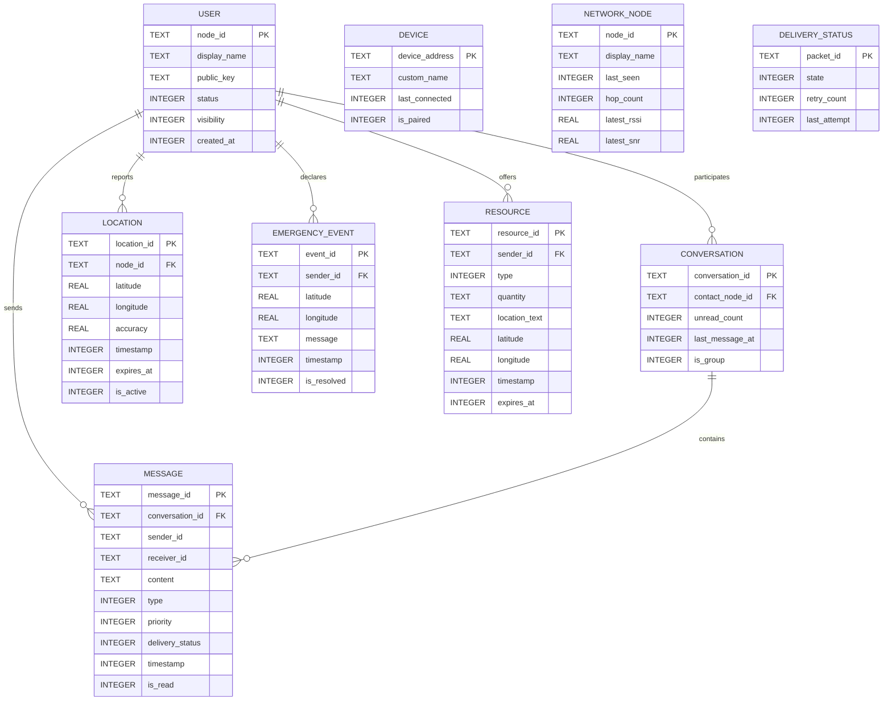

# Database Schema

The Android application stores all persistent states locally using the **Room Persistence Library** over an SQLite engine. This ensures offline-first access to messaging histories, configurations, maps, and network topology.

---

## Entity Relationship Diagram

---

## Entity Definitions

### 1. User (`user`)
Stores the configuration of the local identity (owner of the device).
* **Fields**:
  * `node_id` (TEXT, PK): UUID generated locally at launch.
  * `display_name` (TEXT): Name displayed to contacts.
  * `public_key` (TEXT): Base64 encoded ECDH P-256 public key.
  * `status` (INTEGER): Enum value representing emergency state (0 = Normal, 1 = Emergency, 2 = Rescue, 3 = Coordinator).
  * `visibility` (INTEGER): Boolean flag indicating whether to advertise via BLE.
  * `created_at` (INTEGER): Unix epoch timestamp in milliseconds.

### 2. Device (`device`)
Tracks the paired ESP32 hardware node details.
* **Fields**:
  * `device_address` (TEXT, PK): BLE MAC address of the hardware node.
  * `custom_name` (TEXT): Friendly label assigned by user.
  * `last_connected` (INTEGER): Timestamp of last connection.
  * `is_paired` (INTEGER): Boolean flag indicating active pairing.

### 3. Conversation (`conversation`)
Represents private threads or global groups.
* **Fields**:
  * `conversation_id` (TEXT, PK): Unique thread identifier.
  * `contact_node_id` (TEXT, Nullable, FK): Links to target contact in private chats.
  * `unread_count` (INTEGER): Count of unread incoming messages.
  * `last_message_at` (INTEGER): Timestamp of the last message in thread (used for sorting).
  * `is_group` (INTEGER): Boolean flag (1 = Global Chat/Group).

### 4. Message (`message`)
Persists all text, voice segments, and system events.
* **Fields**:
  * `message_id` (TEXT, PK): UUID matching packet identifier.
  * `conversation_id` (TEXT, FK): Target conversation thread.
  * `sender_id` (TEXT): Node ID of sender.
  * `receiver_id` (TEXT): Node ID of recipient or "BROADCAST".
  * `content` (TEXT): Ciphertext/Plaintext message payload.
  * `type` (INTEGER): Message type Enum (TEXT = 0, VOICE = 1, SOS = 2, LOCATION = 3, RESOURCE = 4).
  * `priority` (INTEGER): Priority level Enum (CRITICAL = 0, HIGH = 1, NORMAL = 2, LOW = 3).
  * `delivery_status` (INTEGER): Status mapping (QUEUED = 0, SENT = 1, DELIVERED = 2, FAILED = 3).
  * `timestamp` (INTEGER): Creation epoch in ms.
  * `is_read` (INTEGER): Read state boolean.

### 5. NetworkNode (`network_node`)
Tracks active or discovered nodes in the mesh using received HELLO packets.
* **Fields**:
  * `node_id` (TEXT, PK): Remote Node's UUID.
  * `display_name` (TEXT): Remote Display Name.
  * `last_seen` (INTEGER): Epoch timestamp of the last message/HELLO.
  * `hop_count` (INTEGER): Number of relays observed to reach this node.
  * `latest_rssi` (REAL): Signal strength tracking indicator.
  * `latest_snr` (REAL): Signal-to-noise ratio.

### 6. Location (`location`)
Caches location shares received from the mesh network.
* **Fields**:
  * `location_id` (TEXT, PK): UUID.
  * `node_id` (TEXT, FK): Target node who reported coordinate.
  * `latitude` (REAL): GPS Latitude.
  * `longitude` (REAL): GPS Longitude.
  * `accuracy` (REAL): Precision threshold in meters.
  * `timestamp` (INTEGER): Epoch timestamp.
  * `expires_at` (INTEGER): Expiry epoch (optional).
  * `is_active` (INTEGER): Boolean flag for active share.

### 7. EmergencyEvent (`emergency_event`)
Caches active SOS declarations reported across the mesh.
* **Fields**:
  * `event_id` (TEXT, PK): SOS unique identifier.
  * `sender_id` (TEXT, FK): Node UUID in distress.
  * `latitude` (REAL): Distressed location Latitude.
  * `longitude` (REAL): Distressed location Longitude.
  * `message` (TEXT): Free text distress payload.
  * `timestamp` (INTEGER): Activation timestamp.
  * `is_resolved` (INTEGER): Boolean resolution flag.

### 8. Resource (`resource`)
Caches logistical entries shared by mesh participants.
* **Fields**:
  * `resource_id` (TEXT, PK): Resource offer UUID.
  * `sender_id` (TEXT, FK): Node UUID offering help.
  * `type` (INTEGER): Resource class (Water = 0, Food = 1, Medical = 2, Shelter = 3, Tools = 4).
  * `quantity` (TEXT): Quantity description.
  * `location_text` (TEXT): Human-readable location coordinates/description.
  * `latitude` (REAL): Resource map marker Latitude.
  * `longitude` (REAL): Resource map marker Longitude.
  * `timestamp` (INTEGER): Publish timestamp.
  * `expires_at` (INTEGER): Self-expiry timestamp.

### 9. DeliveryStatus (`delivery_status`)
Maintains the Store & Forward pending queue.
* **Fields**:
  * `packet_id` (TEXT, PK): Associated message/packet UUID.
  * `state` (INTEGER): Routing/delivery status.
  * `retry_count` (INTEGER): Active attempts count.
  * `last_attempt` (INTEGER): Epoc timestamp of last transmission try.
