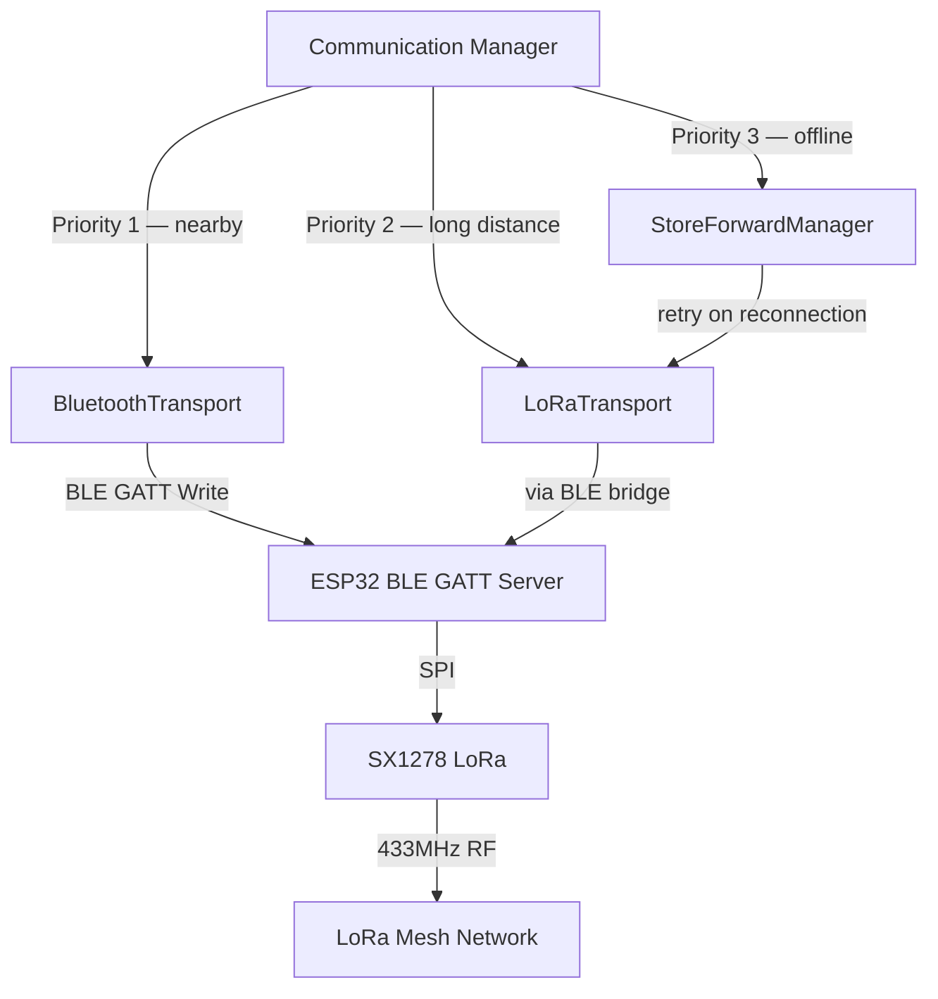
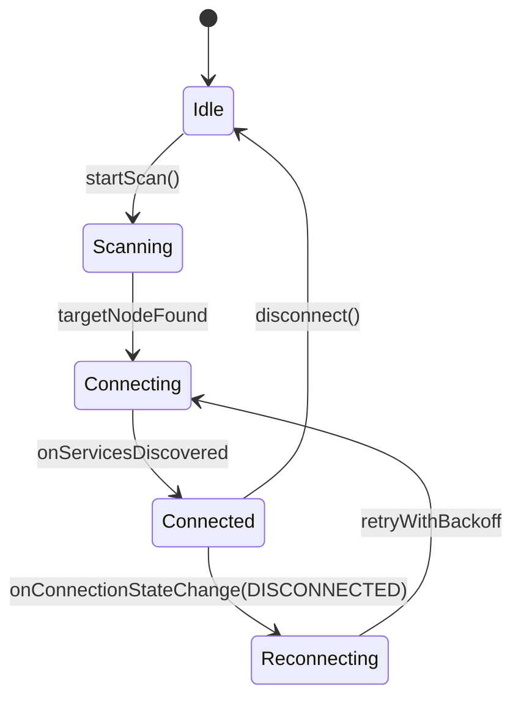
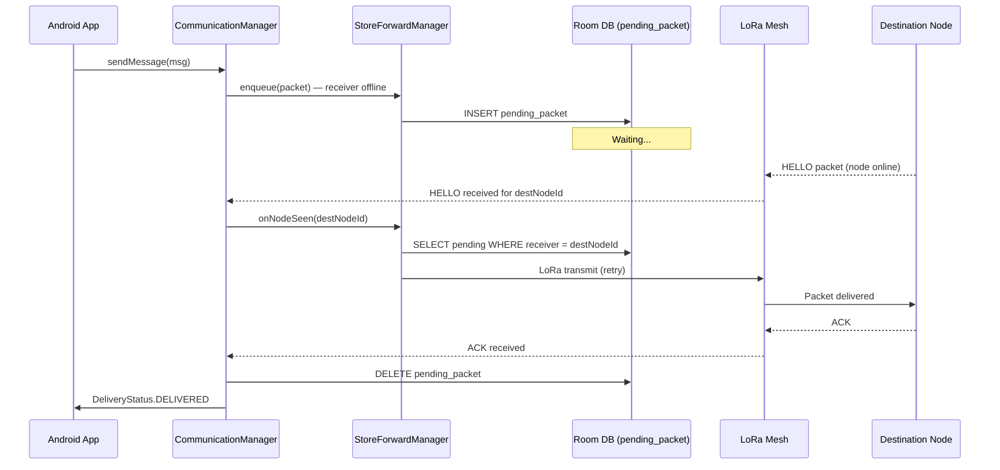

# Transport Layer

**Location:** `data/communication/`  
**Managed by:** [Communication Manager](communication-manager.md)  

---

## Overview

The Transport Layer implements the three delivery mechanisms available to the Communication Manager. Each transport is a discrete class with a consistent interface. The Communication Manager selects between them automatically based on receiver reachability.



---

## Transport 1 — Bluetooth Transport

**Class:** `BluetoothTransport.kt`  
**Use when:** The receiver's ESP32 node is within Bluetooth BLE range (typically up to ~10 m).  
**Latency:** < 500 ms  

### How It Works

1. `BleScanner` continuously scans for BLE advertisements from ESP32 nodes
2. When the receiver's Node ID appears in scan results, `BluetoothTransport` marks them as reachable
3. The packet is written to the ESP32's TX GATT characteristic (BLE GATT Write)
4. The ESP32 receives the packet over BLE and forwards it locally (no LoRa hop needed)
5. An ACK is delivered back via BLE Notify

### BLE GATT Characteristics

| Characteristic | UUID | Direction | Description |
|---|---|---|---|
| TX (App → ESP32) | `0000BEEF-…` | Write Without Response | Outbound packet from Android |
| RX (ESP32 → App) | `0000CAFE-…` | Notify | Inbound packet or ACK |
| Status | `0000BABE-…` | Read, Notify | Power telemetry and node status |

### Connection State Machine



### When Bluetooth Transport Is Unavailable

If BLE connection fails after 3 attempts, `BluetoothTransport` reports the receiver as unreachable and the `CommunicationManager` falls back to **LoRa Transport**.

---

## Transport 2 — LoRa Transport

**Class:** `LoRaTransport.kt`  
**Use when:** The receiver is known on the LoRa mesh but not within BLE range.  
**Range:** 1–5 km per hop (open field); multi-hop for extended coverage  
**Latency:** 500 ms – several seconds depending on hop count  

### How It Works

1. The packet is serialized and passed to the connected ESP32 over BLE (BLE acts as the bridge)
2. The ESP32 adds the packet to its LoRa TX queue
3. The ESP32 transmits the packet over the 433MHz LoRa mesh
4. Intermediate ESP32 nodes relay the packet (TTL-decremented at each hop)
5. The destination ESP32 receives the packet and delivers it to the paired Android app via BLE Notify
6. An ACK traverses back through the mesh to the originating node

### LoRa RF Parameters

| Parameter | Value |
|---|---|
| Frequency | 433.0 MHz |
| Spreading Factor | SF10 |
| Bandwidth | 125 kHz |
| Coding Rate | 4/5 |
| Sync Word | 0xF3 (private network) |
| TX Power | +17 dBm |
| Antenna | 433MHz Rubber Duck SMA (≈ 3 dBi) via U.FL/SMA adapter |

### Receiver Reachability

`LoRaTransport` considers a receiver **known on the mesh** if that Node ID has appeared in a received HELLO packet within the last 10 minutes. HELLO packets are broadcast by every node every 30 seconds.

### Multi-Hop Routing

Each packet carries a TTL (default: 5). At every relay node:
- TTL is decremented by 1
- If TTL reaches 0, the packet is dropped
- The seen-packet cache (keyed by `sender + packet_id`) prevents duplicate forwarding

---

## Transport 3 — Store & Forward

**Class:** `StoreForwardManager.kt`  
**Use when:** The receiver is offline or cannot be reached via Bluetooth or LoRa.  
**Delivery:** Guaranteed eventual delivery when receiver reconnects to the mesh  

### How It Works

1. The packet is serialized and stored in the Room `pending_packet` table with priority and retry metadata
2. A background worker polls the pending queue every 10 seconds
3. When a HELLO packet is received from the destination Node ID, the queued packets for that node are dequeued and passed to `LoRaTransport`
4. On successful ACK, the entry is deleted from `pending_packet`
5. On failure, retry count is incremented and the packet remains in the queue

### Store & Forward Sequence



### Pending Packet Table

| Column | Type | Description |
|---|---|---|
| `packet_id` | TEXT (PK) | Packet UUID |
| `payload_json` | TEXT | Full serialized packet JSON |
| `priority` | INTEGER | Routing priority (0=Critical … 3=Low) |
| `retry_count` | INTEGER | Number of delivery attempts so far |
| `created_at` | INTEGER | Original creation timestamp (ms) |
| `last_attempt_at` | INTEGER | Timestamp of most recent attempt |

### Retirement Conditions

A pending packet is removed from the queue when:
- ACK is received (successful delivery)
- TTL has expired (packet is too old to be useful)
- `retry_count` has reached the configured maximum (default: 20)

---

## Transport Interface Contract

All three transports implement the same sealed interface, allowing the `CommunicationManager` to treat them interchangeably:

```kotlin
interface Transport {
    suspend fun send(packet: SerializedPacket): DeliveryStatus
    fun isReceiverReachable(nodeId: String): Boolean
}
```

---

## Related Documents

- [Communication Manager](communication-manager.md) — Transport selection logic and priority rules
- [LoRa Communication](../firmware/lora-communication.md) — SX1278 RF parameters and antenna
- [Packet Protocol](../firmware/packet-protocol.md) — Packet structure, types, and TTL
- [Database Design](database-design.md) — `pending_packet` table schema
