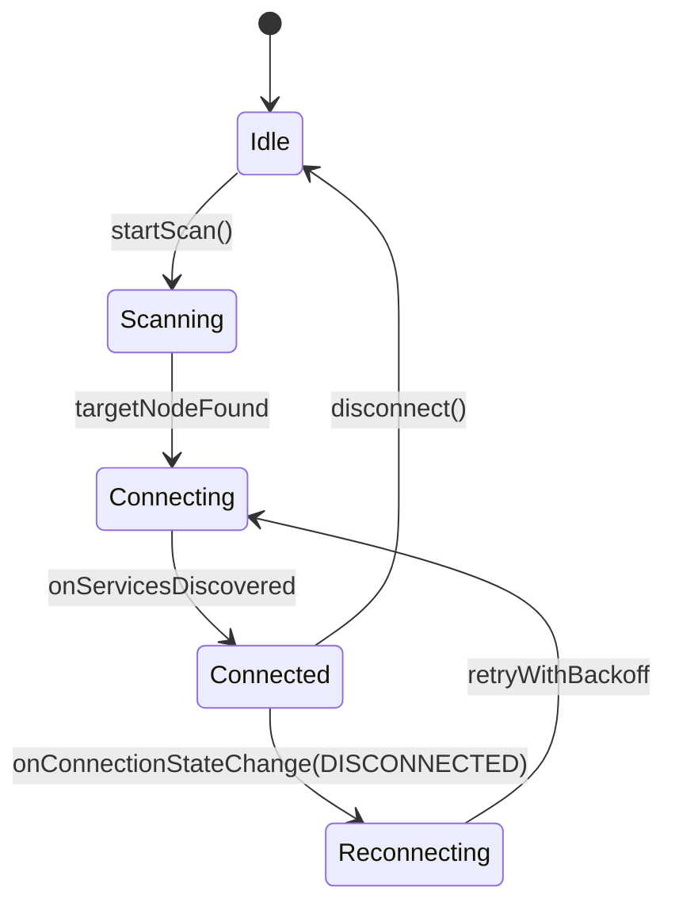

# Bluetooth Transport

The Bluetooth Transport handles direct, low-latency communication between the Android app and the ESP32 node. It runs under the supervision of the `CommunicationManager`.

---

## 1. Bluetooth Low Energy (BLE) Model

To conserve battery on both mobile devices and ESP32 nodes, the system communicates exclusively using **Bluetooth BLE (v4.2/v5.0)**:
* **ESP32 Node**: Acts as a **GATT Server**, advertising its identity and hosting service characteristics.
* **Android Application**: Acts as a **GATT Central** device, scanning for advertisements, initiating connections, and writing/reading values.

---

## 2. GATT Service & Characteristics

The BLE interface exposes a custom GATT Service containing three characteristics:

| Characteristic | UUID | Properties | Purpose |
|---|---|---|---|
| **TX Characteristic** | `0000BEEF-0000-1000-8000-00805F9B34FB` | Write (No Response) | App writes serialized outbound packets here. |
| **RX Characteristic** | `0000CAFE-0000-1000-8000-00805F9B34FB` | Notify | ESP32 notifies App when inbound packets arrive from LoRa. |
| **Status Characteristic** | `0000BABE-0000-1000-8000-00805F9B34FB` | Read, Notify | Telemetry feed (voltage, current, health metrics). |

---

## 3. Connection State Machine

The Android application manages connectivity status using a state flow featuring exponential backoff retries:

---

## 4. MTU & Packet Fragmentation

Standard BLE payloads are bounded by MTU limits.
* The application requests a high MTU negotiation on connection (up to **512 bytes**).
* If negotiated MTU is low, large packets (such as voice recordings) are fragmented into 240-byte chunks by the application's serialization layer, marked with sequence numbers, and reassembled at the destination.
