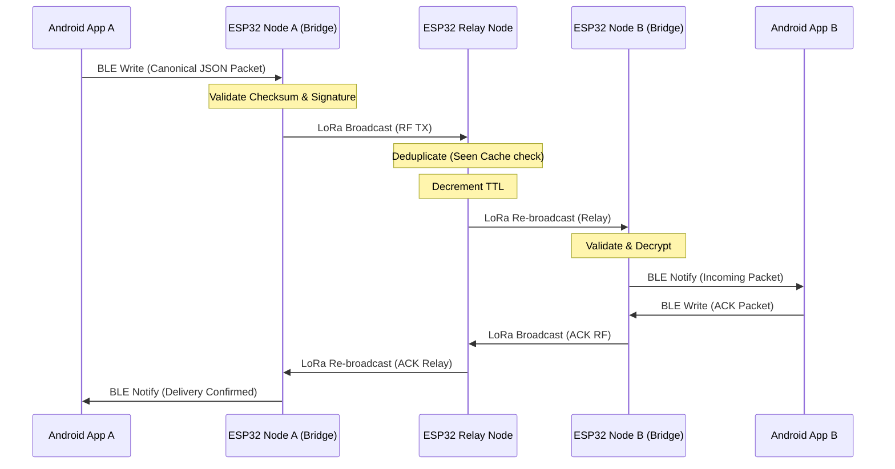

# Message Protocol

This document outlines the routing guidelines, packet validation steps, and duplicate prevention logic executed by both the Android app and the ESP32 node.

---

## 1. Packet Flow Lifecycle

---

## 2. Protocol Routing Steps

### A. Packet Creation
1. **Serialization**: The app builds a JSON object containing message headers (sender, receiver, priority) and payload details.
2. **Encryption**: If private, the payload is encrypted using AES-256-GCM.
3. **Signatures**: An HMAC-SHA256 signature is calculated over the canonical header and payload fields.
4. **BLE Transport**: The app writes the complete string to the paired ESP32 node via the BLE TX characteristic.

### B. Validation at Relay
Each receiving node checks incoming packets:
1. **Structural Verification**: Verifies JSON schema compliance.
2. **Signature Verification**: Verifies HMAC signature using the sender's public key. Invalid signatures are dropped.
3. **Seen Cache Check**: Compares packet UUID against the seen-packet cache. If matching, the packet is discarded.

### C. Routing & Relay Decisions
* If `receiver_id` matches the node's Node ID:
  * Decrypt the message and forward it to the paired Android app via BLE Notify.
  * Generate an `ACK` packet and queue it for transmission.
* If `receiver_id` does not match:
  * Decrement `TTL` by 1.
  * If `TTL > 0`, add packet to the priority TX queue for retransmission.
  * If `TTL = 0`, discard packet.

---

## 3. Duplicate Prevention

To prevent message loops, the system implements two defense lines:
1. **Unique IDs**: Every packet holds a UUID v4.
2. **Circular Seen Cache**: ESP32 memory hosts a 128-entry seen-cache buffer. When a packet is validated, its signature hash is stored. Relays drop any packet matching an active seen-cache entry.
3. **Age Validation**: Android nodes discard packets older than 5 minutes relative to local time to protect against replay attacks.
