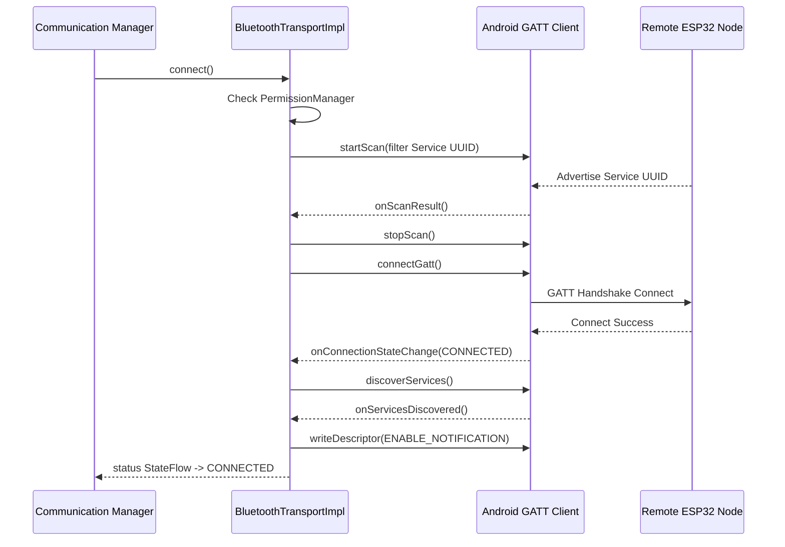

# Bluetooth BLE Transport Layer — Phase A9

## BLE Transport Architecture

The Bluetooth Low Energy (BLE) Transport Layer bridges core messaging packages directly over physical GATT layers on Android:

```
 ┌───────────────────────────┐
 │   Communication Manager   │
 └─────────────┬─────────────┘
               │ selects active channel
 ┌─────────────▼─────────────┐
 │   BluetoothTransportImpl  │  (Implements Transport interface)
 └─────────────┬─────────────┘
               │ scans & connects
 ┌─────────────▼─────────────┐
 │   Android BluetoothGatt   │
 └───────────────────────────┘
```

---

## GATT Service & Characteristics Definitions

To establish connection links with physical transceivers (e.g. ESP32, helper relays), the transport layer queries and binds custom UUIDs:

- **Service UUID**: `0000FF10-0000-1000-8000-00805F9B34FB`
- **Rx Characteristic UUID**: `0000FF11-0000-1000-8000-00805F9B34FB` (For writing payload data to the node).
- **Tx Characteristic UUID**: `0000FF12-0000-1000-8000-00805F9B34FB` (For receiving notifications from the node).
- **Client Configuration Descriptor**: `00002902-0000-1000-8000-00805F9B34FB` (Used to subscribe to Tx notifications).

---

## Scan & Connection Lifecycle Flow



---

## Battery-Saving Scan Settings

To minimize battery drain under emergency outdoor settings:
1. **Target Filters**: Scanning utilizes service UUID filters to avoid waking up application logic on unrelated beacons (e.g. contact tracers, tags).
2. **Low-Latency to Low-Power**: Scans execute in `SCAN_MODE_LOW_LATENCY` during the initial 10-second connect search, and automatically stop when a candidate device is detected.

---

## Permission Requirements

The layer integrates with the Phase A7 permission controller. Triggers verify:
- `Manifest.permission.BLUETOOTH_SCAN`: Needed to locate peripherals.
- `Manifest.permission.BLUETOOTH_CONNECT`: Needed to start GATT sessions.
- `Manifest.permission.ACCESS_FINE_LOCATION`: Required by the OS to retrieve BLE scanning results.
