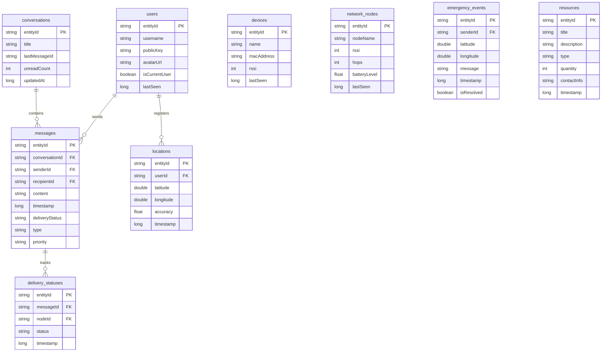

# Database Architecture & Schema Design — Phase A5

## Overview

The Offline Emergency Mesh Communication System adopts a strict **Offline-First** design pattern. The local SQLite database, managed via the **Jetpack Room Library**, serves as the single source of truth (SSOT) for all application data layers. 

Future LoRa and Bluetooth mesh sync protocols will operate by updating local database values, which then reactively update the UI through Kotlin Flows.

---

## Entity Relationships (ERD)

The database schema encloses 9 core tables structured as follows:

---

## Database Classes Reference

### 1. Database Class
[`AppDatabase`](../../android/app/src/main/java/com/mesh/emergency/data/local/database/AppDatabase.kt) is the central database controller:
- Database Name: `mesh_emergency.db`
- Current Schema Version: `1`
- Schema Export: Disabled (`exportSchema = false` for alpha build phase)

### 2. Type Converters
Custom data transformations are managed in [`Converters`](../../android/app/src/main/java/com/mesh/emergency/data/local/database/Converters.kt):
- Maps `DbDeliveryStatus`, `DbMessageType`, and `DbMessagePriority` enums to standard String primitives.

---

## DAO Architecture

Database access operations are split into 9 modular interface DAOs under `com.mesh.emergency.data.local.dao.*`:

| DAO | Table targeted | Key Operations | Reactive type |
|---|---|---|---|
| `UserDao` | `users` | Current Profile info query, contacts listing | `Flow<List<UserEntity>>` |
| `DeviceDao` | `devices` | BLE discovered cache update, table clean | `Flow<List<DeviceEntity>>` |
| `ConversationDao` | `conversations` | Groupings list, updates | `Flow<List<ConversationEntity>>` |
| `MessageDao` | `messages` | History streams, single inserts | `Flow<List<MessageEntity>>` |
| `NetworkDao` | `network_nodes` | Hops telemetry diagnostics | `Flow<List<NetworkNodeEntity>>` |
| `LocationDao` | `locations` | Telemetry tracker coordinates maps | `Flow<List<LocationEntity>>` |
| `ResourceDao` | `resources` | Supplies catalog queries | `Flow<List<ResourceEntity>>` |
| `EmergencyEventDao` | `emergency_events` | SOS distress beacons feeds | `Flow<List<EmergencyEventEntity>>` |
| `DeliveryStatusDao` | `delivery_statuses` | Message packet tracing logs | `Flow<List<DeliveryStatusEntity>>` |

---

## Local Data Source Isolation

To follow Clean Architecture separation of concerns:
1. Room DAOs are **not** exposed directly to repositories.
2. The [`LocalDataSource`](../../android/app/src/main/java/com/mesh/emergency/data/local/LocalDataSource.kt) interface defines standard database queries.
3. The concrete implementation [`LocalDataSourceImpl`](../../android/app/src/main/java/com/mesh/emergency/data/local/LocalDataSourceImpl.kt) consumes `AppDatabase` and triggers Room DAO methods.
4. Repositories depend on `LocalDataSource` and handle the mapping of DB Entities to Domain Models.

---

## Schema Migration Framework

Incremental database revisions are handled using Room migrations:
- Registered migrations map inside [`DatabaseModule.kt`](../../android/app/src/main/java/com/mesh/emergency/di/DatabaseModule.kt).
- Future additions of database columns or tables must be defined as SQL statements inside explicit `Migration(start, end)` blocks to prevent losing user message histories.
- Downgrades trigger a safe database rebuild fallback via `.fallbackToDestructiveMigrationOnDowngrade()`.
