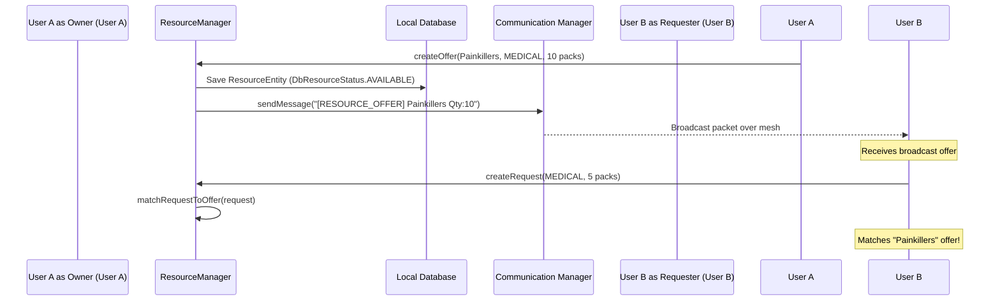

# Resource Sharing & Emergency Resource Management — Phase A17

## Resource Architecture

The Resource Sharing subsystem matches local needs with available services in the offline mesh, storing lists locally and propagating updates via LoRa/Bluetooth packets:

```
 ┌───────────────────────────┐
 │     Resource Manager      │  (Matches requests and offers)
 └─────────────┬─────────────┘
               │ ResourceEntity
 ┌─────────────▼─────────────┐
 │    Resource Repository    │  (Manages DB logs)
 └─────────────┬─────────────┘
               │
 ┌─────────────▼─────────────┐
 │       Room Database       │  (Persists locally)
 └───────────────────────────┘
```

---

## Resource Sharing Flow



---

## Category Specifications

Resources map to the following classifications:
- **`MEDICAL`**: Medicine, first aid materials, emergency surgery kits, doctor/nurse volunteers.
- **`FOOD`**: Bottled water, canned foods, rations.
- **`SHELTER`**: Tents, dry zones, coordinates of secure halls.
- **`EQUIPMENT`**: Flashlights, LoRa routers, batteries, tools.
- **`SERVICE`**: Transport aid, debris clearing assistance.

---

## Privacy Levels & Controls

To protect resource cache integrity and user security:
- **`PUBLIC`**: Telemetry broadcasted to all nodes in the mesh.
- **`TRUSTED_ONLY`**: Shared only with paired contacts (validated in Phase A14).
- **`PRIVATE`**: Stored locally on-disk only, never broadcasted.

---

## Expiration & TTL Systems

Symmetric timers check food and medicine lifespans. Toggling `expireResources()` scans database items:
- If a listing's TTL timestamp has passed, its status updates to `EXPIRED`.
- Expired items are ignored by matching sweeps.
