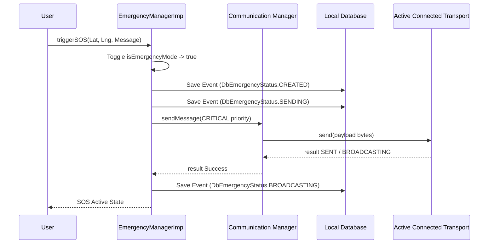

# Emergency SOS & Alerts System — Phase A15

## Emergency Architecture

Emergency communications operate with absolute priority over standard chat traffic. When an operator triggers an SOS, the app forces a high-frequency broadcast sweep, utilizing the highest priority channels:

```
  ┌───────────────────────────┐
  │     SOS Alert Trigger     │
  └─────────────┬─────────────┘
                │
  ┌─────────────▼─────────────┐
  │     Emergency Manager     │  ◄── (Sets isEmergencyMode = true)
  └─────────────┬─────────────┘
                │ instantiates SOS event
  ┌─────────────▼─────────────┐
  │   Communication Manager   │  ◄── (Sets priority = CRITICAL)
  └─────────────┬─────────────┘
                ├───────────────────────┐
  ┌─────────────▼─────────────┐   ┌─────▼─────────────────────┐
  │    Bluetooth Transport    │   │      LoRa Transport       │
  └───────────────────────────┘   └───────────────────────────┘
```

---

## SOS Message Flow Lifecycle



---

## Priority Hierarchies & Rules

All packets carry a priority level inside their headers. Standard routers (nodes forwarding packets in the mesh network) process packets using priority-queue sorting:

- **`CRITICAL` (SOS Alert)**: Processed instantly. Drops normal chat logs from forwarding buffers if memory is constrained.
- **`HIGH` (Emergency Info)**: Priority transmission for rescue updates.
- **`NORMAL` (Direct Chat)**: Standard peer chats.
- **`LOW` (Background Telemetry)**: Diagnostic logs, battery reports, and routing tables updates.

---

## Emergency Mode & Battery Management

To maximize battery lifetime on devices operating in emergency disaster areas, toggling SOS forces the system to enter **Emergency Mode**:
1. **Reduced Standby Power**: Disables non-critical background services (e.g. peer profile avatar updates, local diagnostic logs parsing).
2. **Aggressive Transport Retries**: Increases WorkManager queue retry frequencies for SOS packets, while pausing standard chat packet processing.
3. **Important Push Alerts**: Bypasses system do-not-disturb (DND) configurations to play audible alerts when nearby SOS beacons are received.
