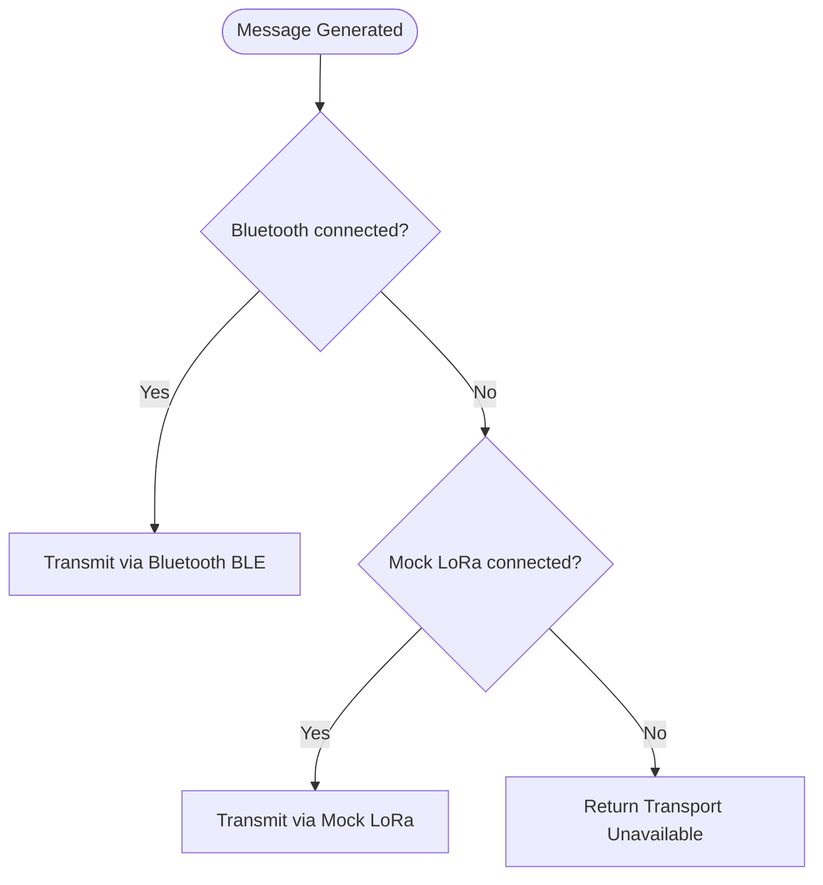

# Mock LoRa Transport Layer — Phase A10

## Mock LoRa Architecture

The Mock LoRa Transport Layer provides local simulation of LoRa radio link dynamics, enabling application components to verify packet routing pipelines without physical radio transceivers:

```
 ┌───────────────────────────┐
 │   Communication Manager   │
 └─────────────┬─────────────┘
               │ selects active channel
 ┌─────────────▼─────────────┐
 │     MockLoRaTransport     │  (Implements Transport interface)
 └─────────────┬─────────────┘
               │ requests configs
 ┌─────────────▼─────────────┐
 │   LoRaSimulationManager   │
 └───────────────────────────┘
```

---

## Simulation Configurations

The network properties are managed via [`LoRaSimulationManager`](../../android/app/src/main/java/com/mesh/emergency/core/communication/lora/LoRaSimulationManager.kt) to govern:

### 1. Transmission Latency (`DelayLevel`)
Simulates radio time-on-air (ToA) propagation delay timings:
- `LOW`: 50ms (Short payloads, nearby nodes).
- `NORMAL`: 500ms (Default mesh packet hops).
- `HIGH`: 2000ms (Congested mesh network, multiple relays).

### 2. Signal Strength Indicators (`SimulatedSignal`)
- `STRONG`: -50 dBm RSSI (Line of sight, immediate proximity).
- `MEDIUM`: -80 dBm RSSI (Obstructed, typical urban setting).
- `WEAK`: -110 dBm RSSI (Marginal range limits).
- `DISCONNECTED`: -120 dBm RSSI (Out of Range. Transport turns unavailable).

### 3. Reliability Checks (`packetLossRate`)
Statistical drop rate percentage (0.0 to 1.0). If a random roll falls below this threshold, the packet transmission fails locally to verify application-level retries.

---

## Transport Selection Fallback Logic

The [`CommunicationManagerImpl`](../../android/app/src/main/java/com/mesh/emergency/data/communication/CommunicationManagerImpl.kt) uses this simulation layer to verify pathing:



---

## Real LoRa Hardware Migration Plan

When upgrading the system to physical transceivers:
1. **Interface Contract**: The new `RealLoRaTransport` will implement the same [`Transport`](../../android/app/src/main/java/com/mesh/emergency/core/communication/Transport.kt) interface.
2. **ESP32 Connection**: Android devices will communicate with an external ESP32 bridge (equipped with an RFM95 / SX1278 LoRa module) via **Bluetooth BLE** or **USB OTG Serial**.
3. **SPI Connection**: For custom Android single-board computers (SBCs), SPI driver linkages will map directly to standard Linux kernel interfaces (e.g. `/dev/spidev0.0`).
