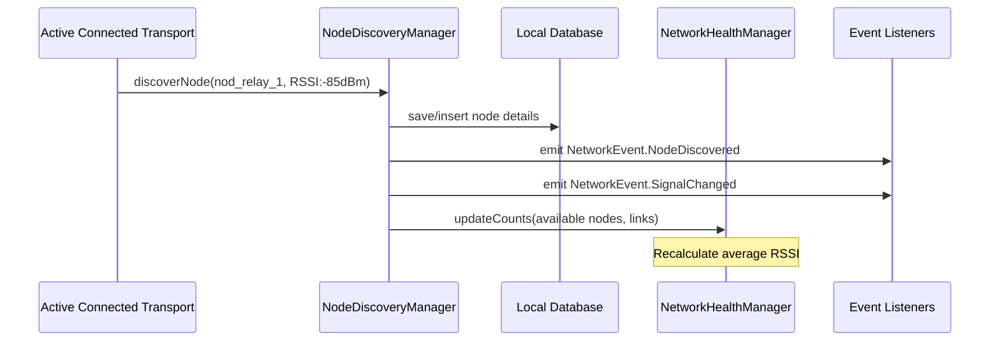

# Network Discovery & Mesh Awareness — Phase A18

## Network awareness Architecture

The Mesh Awareness subsystem coordinates routing topology snapshots, tracking nearby beacon signals, battery thresholds, and link failures offline:

```
 ┌───────────────────────────┐
 │   Node Discovery Manager  │  (Tracks network events flow)
 └─────────────┬─────────────┘
               ├───────────────────────┐
 ┌─────────────▼─────────────┐   ┌─────▼─────────────────────┐
 │    Local SQLite Storage   │   │   Network Health Manager  │
 └───────────────────────────┘   └───────────────────────────┘
```

The app monitors the topology by listening to the [`NodeDiscoveryManager`](../../android/app/src/main/java/com/mesh/emergency/core/network/NodeDiscoveryManager.kt) flow. Health stats are collected reactively inside the [`NetworkHealthManager`](../../android/app/src/main/java/com/mesh/emergency/core/network/NetworkHealthManager.kt).

---

## Mesh Node Telemetry Specifications

Each network router node corresponds to a [`NetworkNodeEntity`](../../android/app/src/main/java/com/mesh/emergency/data/local/entity/NetworkNodeEntity.kt) in Room database records:

- **Node ID / Device ID**: Prefixed unique identity keys.
- **Node Type**:
  - `PHONE_NODE`: Mobile devices running the client app.
  - `LORA_NODE`: ESP32 nodes matching transceiver signals.
  - `RELAY_NODE`: Dedicated repeaters placing packets farther.
  - `GATEWAY_NODE`: Nodes bridging the mesh to external satcom or internet boundaries.
- **Node Status**: `ONLINE`, `OFFLINE`, `WEAK_CONNECTION`, `UNKNOWN`, `UNAVAILABLE`.
- **Signal Parameters**:
  - `RSSI` (Received Signal Strength Indicator): standard dBm metrics (e.g. `-40dBm` is strong, `-110dBm` is weak).
  - `Signal Quality`: percentage conversion scale derived from RSSI.
  - `Connection Type`: `BLE` or `LORA`.
- **Mesh Metrics Placeholders**:
  - `hopCount`: Number of hops a message takes to cross this link.
  - `relayCapability`: Boolean marking whether this node forwards packets.
  - `networkDistance`: Metric calculating path cost.

---

## Network Health Monitoring & Diagnostic Statistics

To ensure the operator can audit connection stability, the health monitor computes stats:
1. **Nodes Count**: Live tally of reachable routing points.
2. **Active Links**: Total connections matching positive statuses.
3. **Failure Rate**: Floating-point percentage ratio of failed packets transmission loops to total transmission attempts.
4. **Average RSSI**: Mean signal quality value representing link stability.

---

## Mesh Awareness Event Pipeline

Listeners subscribe to the shared flow to receive network updates:


