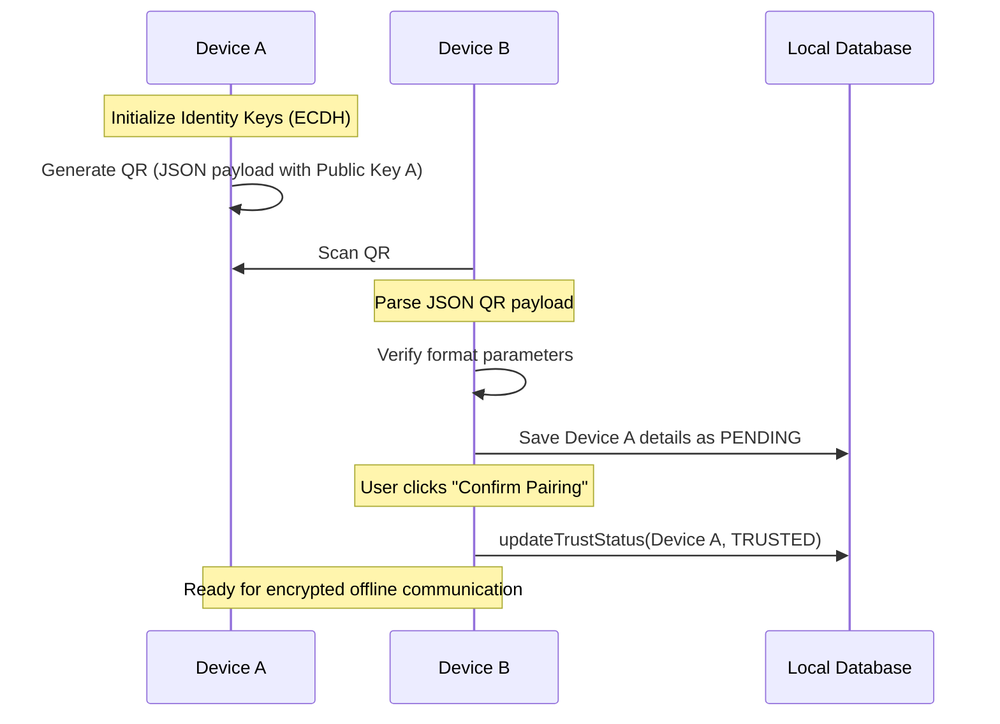

# QR Pairing & Device Discovery — Phase A14

## Device Discovery Architecture

Device Discovery handles locating, identifying, and linking peer endpoints offline:

```
 ┌───────────────────────────┐
 │     Discovery Manager     │
 └─────────────┬─────────────┘
               ├───────────────────────┐
 ┌─────────────▼─────────────┐   ┌─────▼─────────────────────┐
 │    Bluetooth Discovery    │   │      QRCode Discovery     │
 └───────────────────────────┘   └───────────────────────────┘
```

The system decouples transport logic by exposing the standard [`DiscoveryProvider`](../../android/app/src/main/java/com/mesh/emergency/core/discovery/DiscoveryProvider.kt) interface. Future transceivers (BLE scans or LoRa beacons) implement this interface to push candidates into the [`DiscoveryManager`](../../android/app/src/main/java/com/mesh/emergency/core/discovery/DiscoveryManager.kt).

---

## QR Code Handshake Payload Schema

To enable user-guided pairing without internet coordinates matching servers, users generate and scan a handshake QR code. The payload is JSON-formatted and serialized using [`QRHandshakeManager`](../../android/app/src/main/java/com/mesh/emergency/core/discovery/qr/QRHandshakeManager.kt):

- `v` (Version): Payload schema version (default `1`).
- `did` (Device ID): Unique device identifier.
- `uid` (User ID): Unique profile user identifier.
- `dt` (Device Type): Entity type category (e.g. `SMARTPHONE`, `ESP32_RELAY`).
- `pub` (Public Key Ref): Base-64 encoded ECDH identity public key used to derive future session keys.
- `ts` (Timestamp): Creation epoch timestamp.

### JSON Representation Payload Example
```json
{
  "v": 1,
  "did": "dev_a7f920",
  "uid": "usr_9b0c22",
  "dt": "SMARTPHONE",
  "pub": "MFkwEwYHKoZIzj0CAQYIKoZIzj0DAQcDQgAEK...",
  "ts": 1781803600
}
```

---

## Device Trust Model & Roster

Discovered and paired devices cache details inside Room database [`DeviceEntity`](../../android/app/src/main/java/com/mesh/emergency/data/local/entity/DeviceEntity.kt) records. Trust levels map to four distinct statuses:

- `TRUSTED`: Handshake successfully verified. Eligible for message exchanges.
- `PENDING`: Discovered but trust has not been confirmed by the user yet.
- `BLOCKED`: User explicitly blacklisted the device. The app will drop all packets from this ID.
- `UNKNOWN`: Default status for unverified beacons.

---

## Secure Pairing Flow


