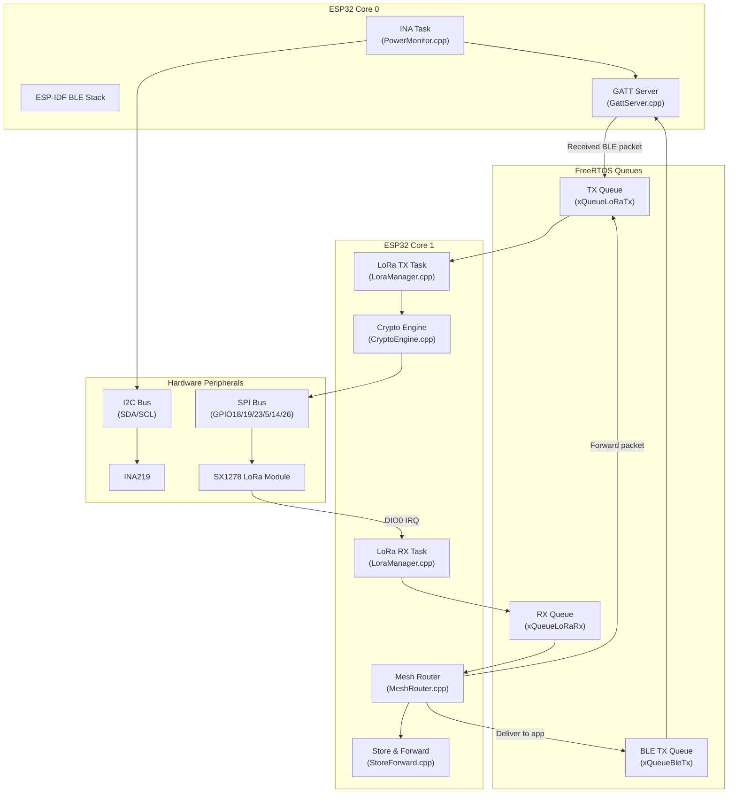
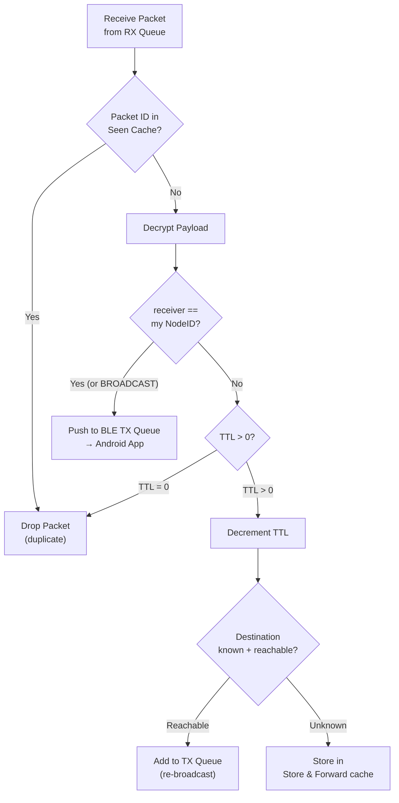

# ESP32 Firmware Architecture

**Hardware:** ESP32 V1.3 Dev Board (CH340C, NodeMCU-32S)  
**Framework:** Arduino Framework (PlatformIO)  
**Language:** C++17  
**RTOS:** FreeRTOS (built into ESP-IDF)  
**Flash Storage:** SPIFFS  

---

## Processor Overview

The ESP32 is a dual-core 240 MHz Xtensa LX6 processor. The firmware uses both cores:

| Core | Assignment |
|---|---|
| Core 0 | Wi-Fi/BLE stack (managed by ESP-IDF), INA219 polling |
| Core 1 | LoRa TX/RX tasks, mesh router, store-and-forward, main loop |

---

## Firmware Architecture Diagram



---

## Source File Structure

```
firmware/
├── src/
│   ├── main.cpp              # setup() and loop(); task creation
│   ├── Config.h              # Pin definitions, constants, tuning parameters
│   │
│   ├── ble/
│   │   ├── GattServer.cpp    # BLE GATT server setup and callbacks
│   │   ├── GattServer.h
│   │   ├── BleAdvertiser.cpp # Advertisement data builder
│   │   └── BleAdvertiser.h
│   │
│   ├── lora/
│   │   ├── LoraManager.cpp   # LoRa init, TX/RX tasks, DIO0 ISR
│   │   ├── LoraManager.h
│   │   └── LoraConfig.h      # Frequency, SF, BW, CR constants
│   │
│   ├── mesh/
│   │   ├── MeshRouter.cpp    # Routing logic, seen-packet cache, TTL
│   │   ├── MeshRouter.h
│   │   ├── StoreForward.cpp  # SPIFFS-backed packet cache, retry logic
│   │   └── StoreForward.h
│   │
│   ├── packet/
│   │   ├── Packet.h          # Packet struct and type enums
│   │   └── PacketSerializer.cpp  # JSON encode/decode
│   │
│   ├── crypto/
│   │   ├── CryptoEngine.cpp  # AES-256-GCM encrypt/decrypt
│   │   └── CryptoEngine.h
│   │
│   ├── power/
│   │   ├── PowerMonitor.cpp  # INA219 I2C driver and polling task
│   │   └── PowerMonitor.h
│   │
│   └── identity/
│       ├── DeviceIdentity.cpp  # Node ID, key pair, NVS persistence
│       └── DeviceIdentity.h
│
├── include/
│   └── Config.h
│
└── platformio.ini
```

---

## FreeRTOS Task Structure

| Task Name | Core | Stack (bytes) | Priority | Interval |
|---|---|---|---|---|
| `TaskLoRaRx` | 1 | 4096 | 10 (high) | ISR-driven |
| `TaskLoRaTx` | 1 | 4096 | 9 | Queue-driven |
| `TaskMeshRouter` | 1 | 4096 | 8 | Queue-driven |
| `TaskStoreForward` | 1 | 2048 | 3 | 10 s periodic |
| `TaskBleNotify` | 0 | 2048 | 7 | Queue-driven |
| `TaskPowerMonitor` | 0 | 2048 | 2 | 5 s periodic |

---

## Device Identity

The Node ID and key pair are generated once and stored in **NVS (Non-Volatile Storage)**. On subsequent boots, the identity is loaded from NVS rather than regenerated.

```cpp
// DeviceIdentity.cpp
void DeviceIdentity::init() {
    nvs_handle_t handle;
    nvs_open("identity", NVS_READWRITE, &handle);

    if (!nodeIdExists(handle)) {
        generateNodeId(handle);     // UUID v4 stored as string
        generateKeyPair(handle);    // ECDH P-256 key pair
    }

    loadNodeId(handle);
    loadPublicKey(handle);
    loadPrivateKey(handle);
    nvs_close(handle);
}
```

---

## BLE GATT Server

The ESP32 acts as a GATT Server. The Android app connects as GATT Central.

### Service and Characteristic UUIDs

| Name | UUID | Properties |
|---|---|---|
| Mesh Service | `0000FEED-0000-1000-8000-00805F9B34FB` | — |
| TX Characteristic (App→ESP32) | `0000BEEF-0000-1000-8000-00805F9B34FB` | Write Without Response |
| RX Characteristic (ESP32→App) | `0000CAFE-0000-1000-8000-00805F9B34FB` | Notify |
| Status Characteristic | `0000BABE-0000-1000-8000-00805F9B34FB` | Read, Notify |

### Write Callback (App → ESP32)
```cpp
void onWrite(BLECharacteristic* pChar) {
    std::string value = pChar->getValue();
    if (value.length() > 0) {
        Packet pkt = PacketSerializer::deserialize(value);
        xQueueSend(xQueueLoRaTx, &pkt, pdMS_TO_TICKS(100));
    }
}
```

---

## LoRa Manager

### Initialization

```cpp
void LoraManager::init() {
    LoRa.setPins(NSS_PIN, RST_PIN, DIO0_PIN);  // GPIO5, GPIO14, GPIO26
    LoRa.begin(433E6);                          // 433 MHz
    LoRa.setSpreadingFactor(10);
    LoRa.setSignalBandwidth(125E3);
    LoRa.setCodingRate4(5);
    LoRa.setSyncWord(0xF3);                     // Custom sync word
    LoRa.enableCrc();
    LoRa.onReceive(onLoRaReceiveISR);
    LoRa.receive();
}
```

### TX Task

```cpp
void TaskLoRaTx(void* param) {
    Packet pkt;
    for (;;) {
        if (xQueueReceive(xQueueLoRaTx, &pkt, portMAX_DELAY)) {
            CryptoEngine::encrypt(pkt);
            std::string serialized = PacketSerializer::serialize(pkt);
            LoRa.beginPacket();
            LoRa.print(serialized.c_str());
            LoRa.endPacket(true);  // async=true, non-blocking
            LoRa.receive();        // return to receive mode
        }
    }
}
```

### RX ISR

The DIO0 pin fires an interrupt when a LoRa packet is received. The ISR posts the raw bytes to the RX queue. All processing happens in `TaskMeshRouter`.

---

## Mesh Router

### Routing Logic



### Seen-Packet Cache
A circular buffer of `(senderID + messageID)` hashes. Capacity: 128 entries. Prevents duplicate forwarding in a mesh flood scenario.

---

## Store and Forward

Packets destined for unreachable nodes are written to SPIFFS as JSON files. The `TaskStoreForward` task runs every 10 seconds and attempts retransmission for each cached packet. Packets are retired after:
- Successfully transmitted (ACK received from mesh)
- TTL has expired
- Maximum retry count (default: 20) exceeded

---

## Power Monitor

```cpp
void TaskPowerMonitor(void* param) {
    INA219 ina(0x40, &Wire);
    ina.begin();
    ina.calibrate(0.1, 1.0);  // 0.1 ohm shunt, 1A max

    for (;;) {
        PowerReading reading;
        reading.voltage_v  = ina.readBusVoltage();
        reading.current_ma = ina.readShuntCurrent() * 1000.0f;
        reading.power_mw   = reading.voltage_v * reading.current_ma;
        reading.timestamp  = millis();

        // Push to BLE status characteristic
        GattServer::updateStatus(reading);
        vTaskDelay(pdMS_TO_TICKS(5000));
    }
}
```

---

## Power Saving

When no BLE client is connected, the ESP32 enters light sleep between LoRa packet intervals.

| Mode | Condition | Current |
|---|---|---|
| Active (BLE + LoRa RX) | BLE connected, listening | ~160 mA |
| Active (LoRa only) | BLE disconnected | ~90 mA |
| Light Sleep | No BLE, between LoRa RX windows | ~20 mA |
| LoRa TX burst | During packet transmission | ~240 mA (peak) |

---

## Configuration Reference (`Config.h`)

```cpp
// SPI Pin Mapping
#define LORA_NSS  5
#define LORA_RST  14
#define LORA_DIO0 26
#define SPI_SCK   18
#define SPI_MISO  19
#define SPI_MOSI  23

// LoRa Parameters
#define LORA_FREQUENCY     433E6
#define LORA_SF            10
#define LORA_BW            125E3
#define LORA_CR            5
#define LORA_SYNC_WORD     0xF3

// Mesh Parameters
#define DEFAULT_TTL        5
#define SEEN_CACHE_SIZE    128
#define MAX_STORE_RETRIES  20
#define STORE_RETRY_INTERVAL_MS 10000

// Power Monitor
#define INA_ADDRESS        0x40
#define INA_SHUNT_OHMS     0.1f
#define INA_MAX_AMPS       1.0f
#define POWER_POLL_MS      5000
```
