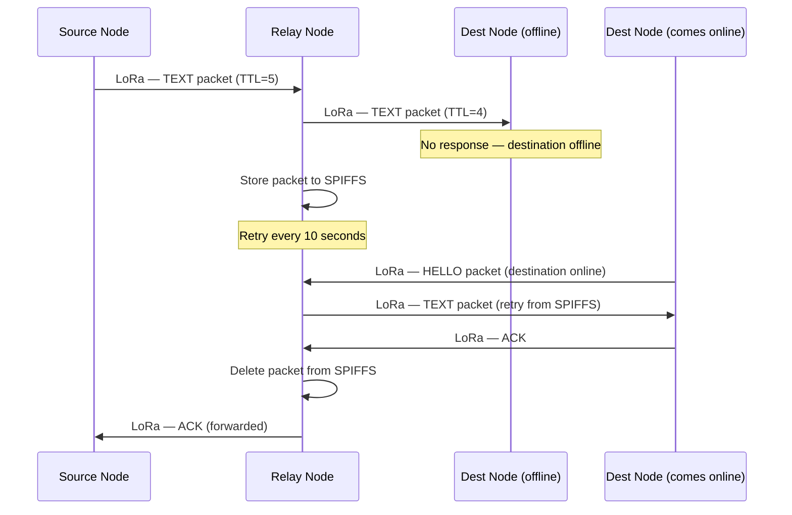

# Packet Protocol

---

## Packet Structure

All messages transmitted over the LoRa mesh network are encoded as JSON objects. JSON is selected for human-readability during development and ease of parsing on both the ESP32 (Arduino JSON library) and Android (Kotlin serialization).

```json
{
  "id":        "a3f2c1d0-8b4e-4a7c-9f1e-2b3c4d5e6f70",
  "type":      "TEXT",
  "sender":    "node-uuid-sender",
  "receiver":  "node-uuid-receiver",
  "priority":  1,
  "payload":   "SGVsbG8gV29ybGQ=",
  "timestamp": 1752748800000,
  "ttl":       5,
  "signature": "base64-hmac-sha256-signature"
}
```

---

## Field Reference

| Field | Type | Max Size | Required | Description |
|---|---|---|---|---|
| `id` | String (UUID) | 36 chars | Yes | Globally unique message identifier. Used for deduplication in the seen-packet cache. Format: UUID v4. |
| `type` | String (Enum) | 12 chars | Yes | Packet type. Determines routing priority and payload interpretation. See Packet Types. |
| `sender` | String (UUID) | 36 chars | Yes | Node ID of the originating device. Set at the source and never modified during relay. |
| `receiver` | String | 36 chars | Yes | Node ID of the intended recipient. Set to `"BROADCAST"` for global mesh messages. |
| `priority` | Integer | 1 byte | Yes | Routing priority. `0`=Critical, `1`=High, `2`=Normal, `3`=Low. Determines TX queue ordering. |
| `payload` | String (Base64) | ~200 bytes | Yes | The message content, Base64-encoded. For private messages, this is AES-256-GCM ciphertext. For broadcasts, plaintext Base64. |
| `timestamp` | Integer (ms) | 13 digits | Yes | Unix epoch timestamp in milliseconds at the moment of packet creation. Used for message ordering and TTL-based expiry in store-and-forward. |
| `ttl` | Integer | 1 byte | Yes | Time-To-Live. Decremented by 1 at each relay node. When TTL reaches 0, the packet is dropped and not forwarded. Maximum value: 5. |
| `signature` | String (Base64) | 44 chars | Yes | HMAC-SHA256 signature over the canonical fields (`id + type + sender + receiver + payload + timestamp`). Verifies packet integrity and authenticates the sender. |

---

## Packet Size Constraints

LoRa at SF10, BW125 has a maximum payload of **255 bytes**. The JSON envelope plus all fields must fit within this limit.

| Component | Estimated Size |
|---|---|
| JSON structural characters | ~30 bytes |
| `id` (UUID) | 36 bytes |
| `type` | up to 12 bytes |
| `sender` (UUID) | 36 bytes |
| `receiver` (UUID or BROADCAST) | 36 bytes |
| `priority`, `ttl`, `timestamp` | ~30 bytes |
| `signature` (Base64 HMAC-SHA256) | 44 bytes |
| **Fixed overhead total** | **~224 bytes** |
| **Available for `payload`** | **~31 bytes** |

> **Note:** For TEXT messages, the payload must be kept concise (< 30 characters per LoRa packet). For longer messages, the firmware splits content across multiple packets with sequence headers embedded in the payload. VOICE messages use a dedicated chunked-transfer protocol.

### Multi-Packet Message Extension

For messages exceeding the single-packet payload limit, the `payload` field carries a JSON sub-object:

```json
{
  "seq": 2,
  "total": 5,
  "msg_id": "parent-message-uuid",
  "data": "base64-encoded-chunk"
}
```

---

## Packet Types

### `HELLO`

**Priority:** Low (3)  
**Receiver:** `BROADCAST`  
**Purpose:** Node discovery and presence announcement. Broadcast periodically (every 30 seconds) by each node.

**Payload fields:**
```json
{
  "display_name": "Ali Hassan",
  "public_key":   "base64-ecdh-public-key",
  "status":       0,
  "firmware_ver": "1.2.0"
}
```

| Field | Description |
|---|---|
| `display_name` | User's display name |
| `public_key` | ECDH P-256 public key — used by recipients to add this node as a contact |
| `status` | 0=Normal, 1=Emergency, 2=Rescue, 3=Coordinator |
| `firmware_ver` | Firmware version string |

---

### `TEXT`

**Priority:** Normal (2) — or High (1) for trusted contact  
**Receiver:** Specific Node ID  
**Purpose:** Private point-to-point text message.

**Payload:** AES-256-GCM encrypted ciphertext (Base64). The plaintext is the raw message string. IV and authentication tag are prepended to the ciphertext.

---

### `GLOBAL_CHAT`

**Priority:** Normal (2)  
**Receiver:** `BROADCAST`  
**Purpose:** Public message visible to all nodes in the mesh.

**Payload:** Plaintext message string (Base64-encoded but not encrypted).

---

### `SOS`

**Priority:** Critical (0)  
**Receiver:** `BROADCAST`  
**Purpose:** Emergency distress signal with GPS coordinates. SOS packets are forwarded by all nodes regardless of TTL state for the first 2 hops.

**Payload fields:**
```json
{
  "lat":       23.8103,
  "lon":       90.4125,
  "accuracy":  15.0,
  "message":   "Trapped under rubble. Need medical assistance.",
  "battery":   62
}
```

| Field | Description |
|---|---|
| `lat` | GPS latitude (decimal degrees) |
| `lon` | GPS longitude (decimal degrees) |
| `accuracy` | GPS accuracy in meters |
| `message` | Optional free-text distress message |
| `battery` | Android device battery percentage at time of SOS |

---

### `LOCATION`

**Priority:** High (1)  
**Receiver:** Specific Node ID or `BROADCAST`  
**Purpose:** Voluntary GPS location share.

**Payload fields:**
```json
{
  "lat":      23.8103,
  "lon":      90.4125,
  "accuracy": 10.0,
  "expires":  1752752400000
}
```

| Field | Description |
|---|---|
| `lat` | GPS latitude |
| `lon` | GPS longitude |
| `accuracy` | Accuracy in meters |
| `expires` | Unix timestamp (ms) when this location share expires |

---

### `VOICE`

**Priority:** Normal (2)  
**Receiver:** Specific Node ID  
**Purpose:** Chunked audio message delivery.

**Payload fields:**
```json
{
  "msg_id":  "parent-voice-message-uuid",
  "seq":     3,
  "total":   8,
  "codec":   "AAC",
  "data":    "base64-encoded-audio-chunk"
}
```

| Field | Description |
|---|---|
| `msg_id` | UUID shared by all chunks of the same voice message |
| `seq` | Chunk sequence number (0-indexed) |
| `total` | Total number of chunks for this message |
| `codec` | Audio codec identifier (`AAC` / `OPUS`) |
| `data` | Base64-encoded audio chunk (max ~200 bytes per chunk) |

---

### `RESOURCE`

**Priority:** Normal (2)  
**Receiver:** `BROADCAST`  
**Purpose:** Announce available resources (food, water, medical, shelter, tools).

**Payload fields:**
```json
{
  "resource_type": 0,
  "quantity":      "50 liters",
  "location_text": "North gate of Dhaka Medical College",
  "lat":           23.7264,
  "lon":           90.3924,
  "expires":       1752766800000
}
```

| Field | Description |
|---|---|
| `resource_type` | 0=Water, 1=Food, 2=Medical, 3=Shelter, 4=Tools |
| `quantity` | Free-text quantity description |
| `location_text` | Human-readable location |
| `lat` / `lon` | GPS location of resource (optional) |
| `expires` | Expiry timestamp in Unix ms |

---

### `ACK`

**Priority:** High (1)  
**Receiver:** Specific Node ID (original sender)  
**Purpose:** Delivery acknowledgement for TEXT and VOICE messages.

**Payload fields:**
```json
{
  "ack_id":    "uuid-of-acknowledged-packet",
  "delivered": true
}
```

| Field | Description |
|---|---|
| `ack_id` | The `id` of the packet being acknowledged |
| `delivered` | Always `true` for a positive ACK |

An ACK is sent by the destination ESP32 node as soon as the received packet is pushed to the BLE TX queue for delivery to the Android app. This indicates successful reception at the hardware level, not necessarily app-level read.

---

## Routing Priority Queue

The ESP32 TX queue sorts packets by the `priority` field before transmission:

| Priority Value | Label | Packet Types |
|---|---|---|
| 0 | Critical | SOS, Emergency Broadcast |
| 1 | High | ACK, LOCATION (rescue-flagged contacts) |
| 2 | Normal | TEXT, VOICE, RESOURCE, GLOBAL_CHAT |
| 3 | Low | HELLO, power telemetry |

If a CRITICAL packet arrives while a NORMAL packet is mid-queue, the CRITICAL packet is inserted at the head of the queue.

---

## Deduplication

Every node maintains a circular buffer of recently seen `(sender + id)` pairs. Maximum size: 128 entries. When a packet arrives:

1. Compute hash of `sender + id`
2. Check against seen-cache
3. If found: drop packet (already processed)
4. If not found: add to seen-cache, proceed with routing

The seen-cache is stored in RAM and cleared on reboot. TTL is the primary protection against infinite loops; deduplication protects against redundant processing within a session.

---

## Store and Forward Protocol


