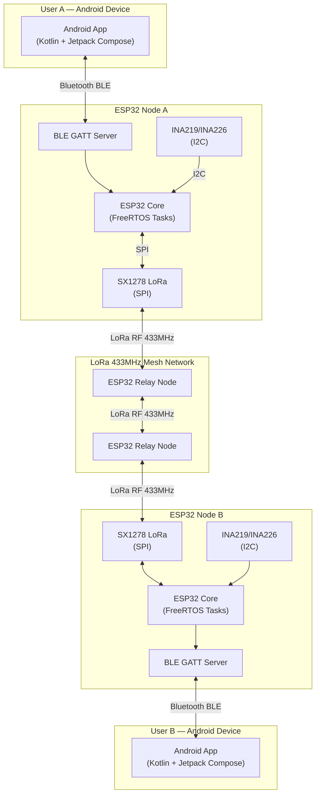
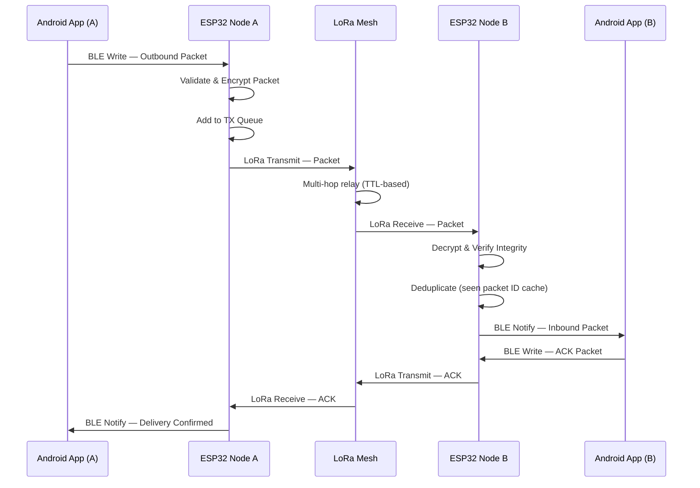
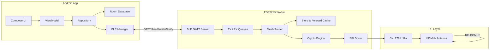
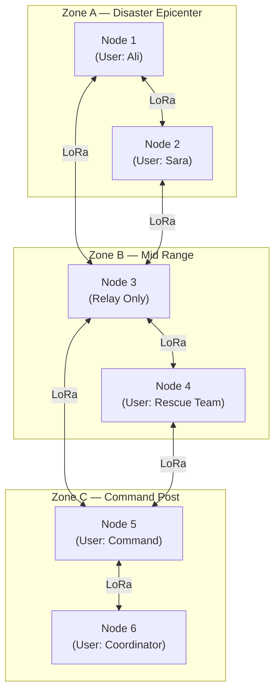
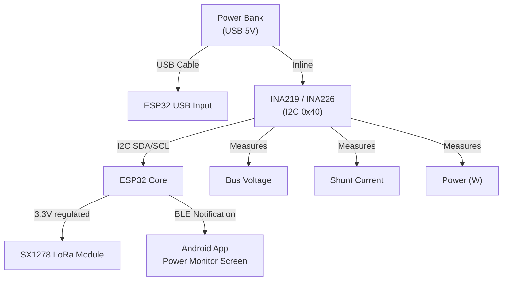

# System Architecture

---

## Architecture Overview

The system consists of three physical layers that work together to form a resilient offline mesh network:

1. **Android Application Layer** — User-facing interface running on Android devices
2. **ESP32 Node Layer** — Embedded hardware bridge between BLE and LoRa
3. **LoRa RF Layer** — Long-range radio mesh network

---

## Component Interaction

### Android App ↔ ESP32 (Bluetooth BLE)

The Android app connects to the ESP32 as a BLE Central device. The ESP32 operates as a GATT Server, exposing custom service UUIDs for message transmit, message receive, and device status characteristics.

- **Transmit Characteristic**: App writes an outbound packet to this characteristic. The ESP32 reads it and queues it for LoRa transmission.
- **Notify Characteristic**: The ESP32 uses BLE notifications to push incoming LoRa packets to the connected Android app.
- **Status Characteristic**: The ESP32 exposes voltage, current, and firmware version as readable values.

The BLE connection is maintained persistently while the app is in foreground. The app handles reconnection automatically on BLE drop.

### ESP32 ↔ SX1278 (SPI)

The ESP32 communicates with the SX1278 module over the SPI bus using the hardware SPI peripheral. The LoRa library configures the SX1278 into LoRa mode and manages packet transmission and reception via interrupt-driven DIO0.

| SPI Role | Function |
|---|---|
| Master | ESP32 |
| Slave | SX1278 |
| Clock (SCK) | GPIO18 |
| MISO | GPIO19 |
| MOSI | GPIO23 |
| Chip Select (NSS) | GPIO5 |
| Reset (RST) | GPIO14 |
| IRQ (DIO0) | GPIO26 |

### ESP32 ↔ INA219/INA226 (I2C)

The current sensor sits on the I2C bus (SDA/SCL). The ESP32 polls it periodically and includes power telemetry in BLE status notifications to the Android app.

---

## Communication Sequence

---

## Data Flow

---

## LoRa Mesh Topology

Each node automatically participates in routing. A packet from Node 1 to Node 6 travels: `N1 → N3 → N5 → N6`, with TTL decrementing at each hop to prevent infinite loops.

---

## Network Topology Properties

| Property | Value |
|---|---|
| Topology type | Flood mesh with TTL |
| Routing algorithm | Store-and-Forward with seen-ID deduplication |
| Maximum hops (TTL) | 5 |
| Frequency | 433 MHz |
| Modulation | LoRa (CSS) |
| Network size | Theoretically unlimited (TTL-bounded per message) |
| Node roles | All nodes relay; no master node required |
| Failure mode | Graceful degradation — surviving nodes continue routing |

---

## Power Monitoring Architecture

