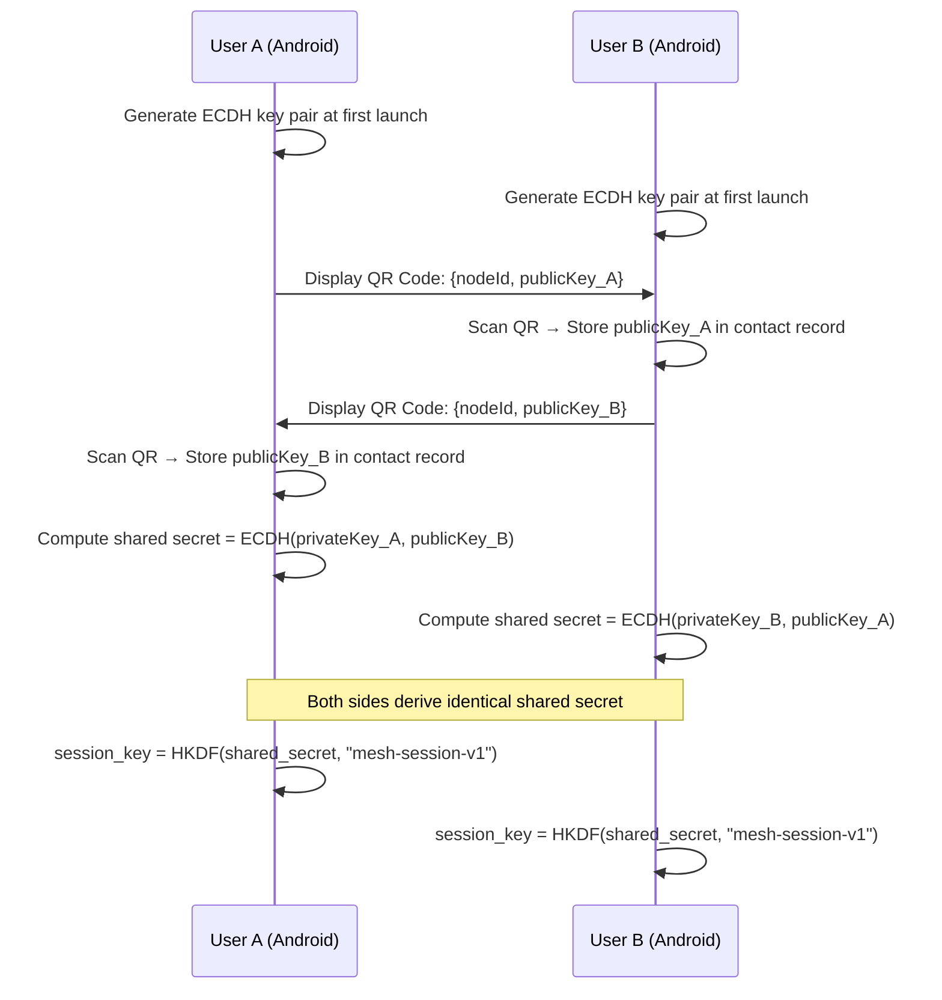

# Security Design

---

## Security Model

The system is designed for emergency and field use where infrastructure is absent. Security cannot rely on central certificate authorities, cloud key servers, or real-time revocation. All cryptographic operations are self-contained on the Android device and ESP32 firmware.

### Threat Model

| Threat | Addressed By |
|---|---|
| Message interception (passive) | AES-256-GCM end-to-end encryption |
| Message tampering | HMAC-SHA256 packet signature |
| Identity spoofing | ECDH public key verification |
| Replay attacks | Timestamp + unique message ID in signature |
| Node impersonation | QR Code key exchange + contact key binding |
| Location tracking | Explicit user consent; no background sharing |
| Broadcast eavesdropping | Global chat is intentionally unencrypted (documented) |

---

## Cryptographic Primitives

| Operation | Algorithm | Key Size | Library |
|---|---|---|---|
| Symmetric encryption | AES-256-GCM | 256-bit | Android: `javax.crypto` / Tink; ESP32: mbedTLS |
| Key exchange | ECDH P-256 | 256-bit | Android: `java.security` EC; ESP32: mbedTLS |
| Message authentication | HMAC-SHA256 | 256-bit | Both |
| Key derivation | HKDF-SHA256 | — | Both |
| Random number generation | CSPRNG | — | Android: `SecureRandom`; ESP32: `esp_random()` |
| Key storage (Android) | Android Keystore (TEE/StrongBox) | — | Android only |
| Key storage (ESP32) | NVS encrypted partition | — | ESP32 NVS |

---

## Key Generation and Management

### Android: Key Pair Generation

On first launch, the app generates an ECDH P-256 key pair:

```kotlin
val keyPairGenerator = KeyPairGenerator.getInstance(
    KeyProperties.KEY_ALGORITHM_EC,
    "AndroidKeyStore"
)
keyPairGenerator.initialize(
    KeyGenParameterSpec.Builder(
        "mesh_identity_key",
        KeyProperties.PURPOSE_AGREE_KEY
    )
    .setAlgorithmParameterSpec(ECGenParameterSpec("secp256r1"))
    .setUserAuthenticationRequired(false)  // Emergency device — no biometric lock
    .build()
)
val keyPair = keyPairGenerator.generateKeyPair()
```

The **private key** is stored in the Android Keystore hardware-backed storage (TEE or StrongBox where available) and **never leaves the secure element**.

The **public key** is stored in Room Database and encoded into the QR code for sharing.

### ESP32: Key Pair Generation

The ESP32 generates its own ECDH P-256 key pair using mbedTLS on first boot:

```cpp
mbedtls_ecp_keypair keypair;
mbedtls_ecp_keypair_init(&keypair);
mbedtls_ecp_gen_key(
    MBEDTLS_ECP_DP_SECP256R1,
    &keypair,
    mbedtls_ctr_drbg_random,
    &ctr_drbg
);
```

Keys are stored in the ESP32 NVS flash partition. NVS encryption (`nvs_flash_secure_init`) is used to protect keys at rest.

---

## End-to-End Encryption Flow

### Key Exchange via QR Code



### Encryption (Sender Side)

```kotlin
fun encryptMessage(plaintext: String, recipientPublicKey: PublicKey): ByteArray {
    val sharedSecret = performECDH(recipientPublicKey)
    val sessionKey = hkdf(sharedSecret, info = "mesh-session-v1")

    val cipher = Cipher.getInstance("AES/GCM/NoPadding")
    val iv = ByteArray(12).also { SecureRandom().nextBytes(it) }
    cipher.init(Cipher.ENCRYPT_MODE, SecretKeySpec(sessionKey, "AES"), GCMParameterSpec(128, iv))

    val ciphertext = cipher.doFinal(plaintext.toByteArray(Charsets.UTF_8))
    return iv + ciphertext  // IV (12 bytes) prepended to ciphertext + GCM tag (16 bytes)
}
```

### Decryption (Receiver Side)

```kotlin
fun decryptMessage(cipherData: ByteArray, senderPublicKey: PublicKey): String {
    val sharedSecret = performECDH(senderPublicKey)
    val sessionKey = hkdf(sharedSecret, info = "mesh-session-v1")

    val iv = cipherData.copyOfRange(0, 12)
    val ciphertext = cipherData.copyOfRange(12, cipherData.size)

    val cipher = Cipher.getInstance("AES/GCM/NoPadding")
    cipher.init(Cipher.DECRYPT_MODE, SecretKeySpec(sessionKey, "AES"), GCMParameterSpec(128, iv))

    return String(cipher.doFinal(ciphertext), Charsets.UTF_8)
}
```

The GCM authentication tag (16 bytes embedded in ciphertext) automatically verifies that the message was not tampered with. Decryption will throw `AEADBadTagException` if the ciphertext was modified.

---

## Packet Integrity (HMAC-SHA256)

Every packet — including unencrypted BROADCAST packets — carries an HMAC-SHA256 signature over its canonical fields. This ensures that no relay node can forge a message from another node's identity.

### Fields Covered by Signature

```
HMAC-SHA256(key=sender_private_signing_key, data=id + type + sender + receiver + payload + timestamp)
```

A separate Ed25519 signing key pair is derived from the identity key and used exclusively for HMAC signing. The signing key never leaves the device.

### Verification

Every relay node and every Android recipient verifies the signature using the sender's public signing key (distributed via HELLO packets and QR codes). Packets with invalid signatures are dropped immediately.

---

## Replay Attack Prevention

A replay attack involves an adversary recording a valid packet and retransmitting it later. Two mechanisms prevent this:

1. **Unique Message ID (`id` field):** Each packet has a UUID v4 `id`. The seen-packet cache at each relay node rejects any packet ID it has already processed.

2. **Timestamp validation:** Recipients reject packets with a timestamp older than 5 minutes from the current device time. Clock synchronization across nodes uses HELLO packet timestamps as a rough reference.

---

## Device Authentication

Nodes authenticate each other through the QR code exchange protocol:

- The QR code contains the Node ID and public key
- Once scanned, the public key is bound to that Node ID in the local contact store
- All subsequent messages from that Node ID are verified against the stored public key
- A message claiming to be from a known Node ID but carrying a signature that doesn't verify against the stored public key is rejected and flagged

---

## Global Chat — Intentional Plaintext

`GLOBAL_CHAT` and `HELLO` packets are not encrypted. This is by design:

- Global chat requires all mesh participants to read the message — there is no defined recipient set
- HELLO packets announce presence and public keys — they must be readable by new nodes without prior key exchange

All users are informed in the UI that global chat is visible to all mesh participants. Private chat remains end-to-end encrypted.

---

## Location Privacy

| Scenario | Behavior |
|---|---|
| App running normally | GPS is not accessed |
| User opens map screen | GPS accessed to show user's own position only |
| User taps "Share Location" | GPS accessed, LOCATION packet sent, timer started |
| SOS activated | GPS accessed immediately, coordinates embedded in SOS |
| App in background | GPS never accessed (no background location permission required) |

The Android app requests `ACCESS_FINE_LOCATION` only. `ACCESS_BACKGROUND_LOCATION` is explicitly **not requested**. The only exception is active SOS mode, which keeps the app foreground via a Notification and a Foreground Service.

---

## ESP32 Encryption Support

The SX1278 RA-02 itself has no encryption hardware. All encryption is performed on the ESP32 using **mbedTLS**, which is bundled with ESP-IDF:

- AES-256-GCM: `mbedtls_gcm_*` API
- ECDH P-256: `mbedtls_ecp_*` API
- HKDF: `mbedtls_hkdf` API
- SHA-256: `mbedtls_sha256_*` API

The ESP32 performs encryption before writing to the LoRa TX queue. Decryption is performed after receiving from the LoRa RX queue, before forwarding to the BLE GATT notify characteristic.

---

## Security Limitations

| Limitation | Notes |
|---|---|
| No forward secrecy | Session keys are derived from static ECDH keys. Compromise of a private key exposes all past messages to that contact. |
| No key revocation | There is no mechanism to revoke a compromised key without re-pairing all contacts. |
| HELLO packets unauthenticated (partially) | HELLO packets carry a public key; without a prior QR exchange, a new contact's public key cannot be verified against a trusted source. |
| Physical device compromise | If the ESP32 is captured, NVS keys can potentially be extracted with JTAG. NVS encryption mitigates but does not eliminate this risk. |
| Global chat is plaintext | Documented and visible in the UI. Use private chat for sensitive communication. |
